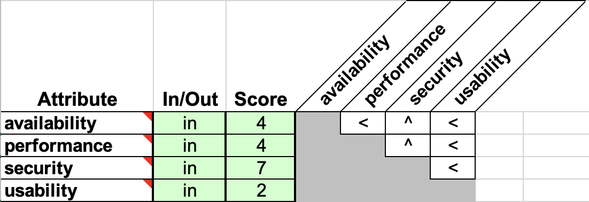

== Método de diseño
Para el proyecto se usara ADD (Attribute Driven Desing) para el diseño y CBSE (Cheesman & Daniels) como proceso de especificación.

=== ADD

El ADD debe recibir ciertas entradas para poder comenzar, así que lo primero que hicimos fue definir cuáles serían las funcionalidades principales y qué atributos de calidad íbamos a considerar como los más importantes; esto último enfocándonos en los problemas actuales para solucionarlos.

Definimos cuatro atributos de calidad importantes:

* Seguridad
* Disponibilidad
* Rendimiento
* Usabilidad

La importancia de estos no fue decidida arbitrariamente, usamos una matriz de importancia de atributos de calidad (ver Matriz de priorización de atributos) donde < significa que el atributo de la fila importa más que el de la columna, mientras que el ^ significa lo contrario.

.Matriz de priorización de atributos

El resultado de la matriz indicó que el más importante sería el atributo de *Seguridad*, nuestra justificación fue porque los _Huéspedes_ ingresarán al sistema datos personales y sus tarjetas o métodos de pago y es inaceptable que estos datos estén en riesgo ya que aparte del peligro para los _Huéspedes_ podría resultar en un problema legal con un gran impacto para los interesados.

*Disponibilidad* y *Rendimiento* resultaron con la misma importancia, pero decidimos darle más peso a la *Disponibilidad* porque queremos un sistema que se pueda consultar en cualquier momento por comodidad de los _Huéspedes_ pero sobre todo del _Auditor_ que debe poder acceder al sistema a cualquier hora del día. Dejamos el *Rendimiento* en segundo plano porque con una buena *Disponibilidad* el *Rendimiento* debe mejorar, es decir, al concentrarnos en la *Disponibilidad* podremos mejorar el rendimiento y que el enfoque en este sea a cumplir con métricas específicas sin arriesgar la seguridad.

Por último, la *Usabilidad