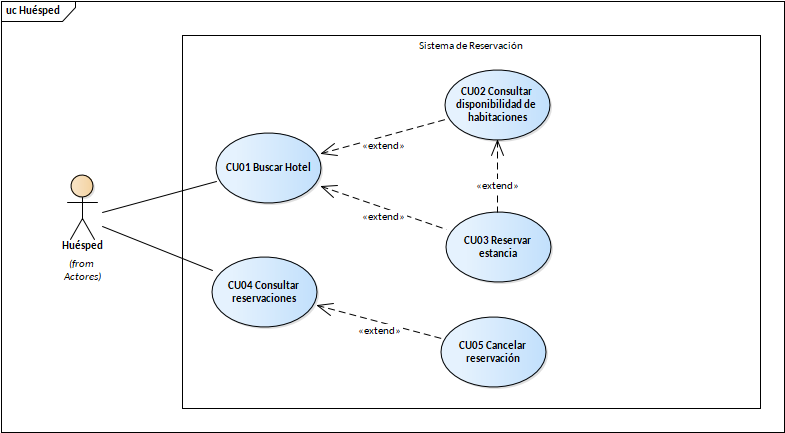
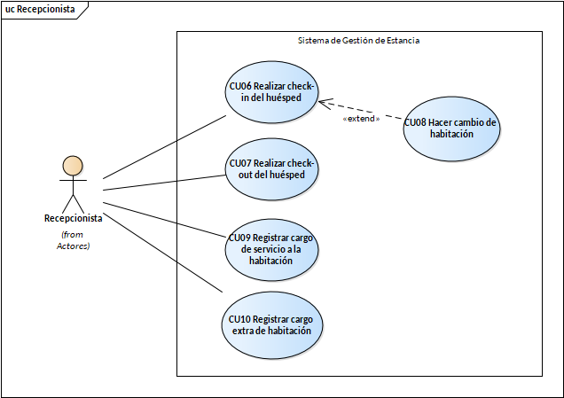

=== Diagramas de caso de uso

.Casos de uso del Huesped

.Casos de uso del Recepcionista

---

=== Descripciones de caso de uso

*CU01 - Buscar hotel* +
*ID:* CU01 +
*Nombre:* Buscar hotel +
*Descripción:* El _Huésped_ busca un hotel para solicitar una estancia +
*Actor(es):* Huésped +
*Disparador:* _Huésped_ selecciona "Buscar hotel” +
*Precondiciones:* N/A

*Flujo Normal* +
1. El _Huésped_ selecciona una ciudad
2. El _Sistema_ muestra los hoteles disponibles en esa ciudad (ver FA01) (ver EX01) +
3. El _Huésped_ puede consultar la disponibilidad de habitaciones (Extiende CU02) +
4. Termina el caso de uso

*Flujos alternos* +

*FA01 - Buscar otro hotel* +
1. El _Huésped_ busca en otra ciudad +
2. Regresa al flujo normal 2

*Excepciones* +

*EX01 – Error al conectarse a la base de datos* +
1. El _Sistema_ informa al _Huésped_ que hubo un error al conectarse a la base de datos +
2. Termina el caso de uso

*Postcondiciones:* El _Huésped_ recibió los datos de un hotel +
*Reglas de negocio:* N/A +
*Incluye:* N/A +
*Extiende:* CU02

---

*CU02 - Consultar disponibilidad de habitaciones* +
*ID:* CU02 +
*Nombre:* Consultar disponibilidad de habitaciones +
*Descripción:* El _Huésped_ consulta la disponibilidad de las habitaciones con ciertas características (fecha de check-in, check-out y cantidad de huéspedes) +
*Actor(es):* Huésped +
*Disparador:* Húesped selecciona "Consultar disponibilidad" +
*Precondiciones:* Haber consultado un hotel antes

*Flujo Normal* +
1. El _Huésped_ selecciona una fecha de check-in, check-out y cantidad de huéspedes y selecciona "Buscar" +
2. El _Sistema_ muestra los cuartos del hotel disponibles con esas características +
3. El _Huésped_ puede reservar una estancia (extiende CU03) +
4. Termina el caso de uso

*Flujos alternos*

*FA01 - Cambiar características* +
1. El _Huésped_ selecciona una fecha de check-in, check-out o cantidad de huéspedes diferentes y selecciona "Buscar" +
2. Regresa al flujo normal 2

*Excepciones*

*EX01 – Error al conectarse a la base de datos* +
1. El _Sistema_ informa al _Huésped_ que hubo un error al conectarse a la base de datos +
2. Termina el caso de uso

*Postcondiciones:* El _Huésped_ pudo ver la disponibilidad de las habitaciones con las características seleccionadas +
*Reglas de negocio:* +
*Incluye:* +
*Extiende:* CU03 +

---

*CU03 - Reservar estancia* +
*ID:* CU03 +
*Nombre:* Reservar una habitación +
*Descripción:* El Huésped reserva una habitación para hospedarse +
*Actor(es):* Huésped +
*Disparador:* Huésped selecciona “Reservar” +
*Precondiciones:* Haber buscado un hotel o consultado la disponibilidad de una habitación

*Flujo Normal* +
1. El _Sistema_ muestra los datos de la habitación solicitada (Ver EX01) +
2. El _Huésped_ selecciona "Reservar la habitación" (ver FA01) +
3. El _Sistema_ solicita los datos de pago al _Huésped_ +
4. El _Huésped_ ingresa sus datos de pago y selecciona “Pagar” +
5. El _Sistema_ envía los datos al Sistema de cobros (Ver EX02) +
6. El _Sistema_ envía al _Huésped_ su comprobante de pago y de reservación +
7. Termina el caso de uso

*Flujos alternos*

*FA01 - Cancelar* +
1. El _Huésped_ selecciona "Cancelar"
2. Termina el caso de uso

*Excepciones*

*EX01 – Error al conectarse a la base de datos* +
1. El _Sistema_ informa al _Huésped_ que hubo un error al conectarse a la base de datos +
2. Termina el caso de uso

*EX02 – Error al procesar el pago*
1. El _Sistema_ informa al _Huésped_ que hubo un error al realizar el cobro +
2. Termina el caso de uso

*Postcondiciones:* +

* POST01: El Huésped reservó una habitación y recibió su comprobante
* POST02: Se actualiza el estado de la habitación

*Reglas de negocio:* N/A +
*Incluye:* N/A +
*Extiende:* N/A

---

*CU04 - Consultar reservaciones* +
*ID:* CU04 +
*Nombre:* Consultar reservaciones +
*Actores:* Huésped +
*Descripción:* El _Huésped_ consulta las reservaciones pendientes que tiene +
*Precondiciones:* El _Huésped_ debe tener reservaciones activas

*Flujo normal* +
1. El _Huésped_ selecciona "Reservaciones" +
2. El _Sistema_ muestra las reservaciones del _Huésped_ activas (ver EX01) +
3. El _Huésped_ puede cancelar una reservación (extiende CU05) +
4. Termina el caso de uso

*Flujos alternos*

*Excepciones* +

*EX01 – Error al conectarse a la base de datos* +
1. El _Sistema_ informa al _Huésped_ que hubo un error al conectarse a la base de datos +
2. Termina el caso de uso

*Postcondiciones:* El _Huésped_ consultó sus reservaciones activas +
*Reglas de negocio* N/A +
*Incluye:* N/A +
*Extiende:* CU05

---

*CU05 – Cancelar reservación* +
*ID:* CU05 +
*Nombre:* Cancelar reservación +
*Descripción:* El Huésped cancela una reservación +
*Actores:* Huésped +
*Disparador:* Huésped selecciona “Cancelar reservación” +
*Precondiciones:* El _Huésped_ debe tener al menos una reserva activa

*Flujo Normal* +
1. El _Huésped_ selecciona un método de pago (ver FA01) +
2. El _Sistema_ envía los datos de pago al _Sistema de pagos_ +
3. El _Sistema_ confirma la transacción (ver EX01) +
4. El _Sistema_ envía el recibo de pago al _Huésped_ y actualiza el estado de la habitación (ver EX01) +
5. Termina el caso de uso

*Flujos alternos*

*FA01 - ingresar método de pago* +
1. El _Huésped_ selecciona "Nuevo método de pago" +
2. El _Sistema_ registra el método de pago +
3. Regresa a flujo normal 2 +

*Excepciones*

*EX01 – Error al procesar el pago*
1. El _Sistema_ informa al _Huésped_ que hubo un error al realizar el cobro +
2. Termina el caso de uso

*Postcondiciones:* 

* POST01: El _Huésped_ canceló una reserva
* POST02: Se actualizó el estado de la habitación

*Reglas de negocio:* N/A +
*Incluye:* N/A +
*Extiende:* N/A

---

*CU06 - Realizar check-in*

*ID:* CU06 +
*Nombre:* Realizar check-in +
*Actores:* Recepcionista +
*Descripción:* El _Recepcionista_ registra la entrega de la habitación al _Huésped_ +
*Precondiciones:* La habitación que se va a entregar debe estar disponible

*Flujo normal* +
1. El _Recepcionista_ ingresa los datos de reservación del _Huésped_ +
2. El _Sistema_ muestra los detalles de la reservación +
3. El _Huésped_ puede querer cambiar de habitación (ver CU08) +
4. El _Recepcionista_ ingresa los datos de pago del _Huésped_ +
5. El _Sistema_ corrobora que los datos de pago sean válidos (ver EX02) +
6. El _Sistema_ actualiza el estado de la habitación +
7. Termina el caso de uso

*Flujos alternos*

*Excepciones* +

*EX01 – Error al conectarse a la base de datos* +
1. El _Sistema_ informa al _Recepcionista_ que hubo un error al conectarse a la base de datos +
2. Termina el caso de uso

*EX02 – Error al procesar el pago* +
1. El _Sistema_ informa al _Recepcionista_ que hubo un error al realizar el cobro +
2. Termina el caso de uso

*Postcondiciones:*

* POST01: El check-in es realizado con éxito
* POST02: Se actualiza el estado de la habitación

*Reglas de negocio:* N/A +
*Incluye:* N/A +
*Extiende:* CU08

---

*CU07 - Realizar check-out*
*ID:* CU07 +
*Nombre:* Realizar check-out +
*Actores:* Recepcionista +
*Descripción:* El _Recepcionista_ registra la liberación de la habitación del _Huésped_ +
*Precondiciones:* La habitación que se va a entregar debe haber estado ocupada

*Flujo normal* +
1. El _Recepcionista_ ingresa los datos de estancia del _Huésped_ +
2. El _Sistema_ muestra los detalles de la estancia (ver EX01) +
4. El _Recepcionista_ selecciona el método de pago del _Huésped_ +
5. El _Sistema_ envía el método de pago al sistema de pagos (ver EX02) +
6. El _Ssitema_ recibe el comprobante de pago del sistema de pagos +
7. El _Sistema_ actualiza el estado de la habitación +
8. Termina el caso de uso

*Flujos alternos*

*Excepciones* +

*EX01 – Error al conectarse a la base de datos* +
1. El _Sistema_ informa al _Recepcionista_ que hubo un error al conectarse a la base de datos +
2. Termina el caso de uso

*EX02 – Error al procesar el pago* +
1. El _Sistema_ informa al _Recepcionista_ que hubo un error al realizar el cobro +
2. Termina el caso de uso

*Postcondiciones:*

* POST01: El check-out es realizado con éxito
* POST02: Se actualiza el estado de la habitación

*Reglas de negocio:* N/A +
*Incluye:* N/A +
*Extiende:* N/A

---

*CU08 - Cambiar habitación* +
*ID:* CU08 +
*Nombre:* Cambiar habitación +
*Actores:* Recepcionista +
*Descripción:* El _Recepcionista_ cambia la habitación de la estancia del _Huésped_ +
*Precondiciones:* Debe haber habitaciones disponibles

*Flujo normal* +
1. El _Sistema_ muestra las habitaciones disponibles junto con su precio (ver EX01) +
2. El _Recepcionista_ selecciona la que el _Huésped_ desee (ver FA01) +
3. El _Sistema_ actualiza el estado de la habitación +
4. Termina el caso de uso

*Flujos alternos*

*FA01 - Cancelar cambio de habitación* +
1. El _Recepcionista_ selecciona "Cancelar" +
2. El _Sistema_ cancela la operación +
3. Termina el caso de uso

*Excepciones*

*EX01 – Error al conectarse a la base de datos* +
1. El _Sistema_ informa al _Recepcionista_ que hubo un error al conectarse a la base de datos +
2. Termina el caso de uso

*Postcondiciones:* Se cambió la habtiación del _Huésped_
*Reglas de negocio* N/A
*Incluye:* N/A
*Extiende:* N/A

---

*CU09 - Registrar cargo de servicios a la habitación* +
*ID:* CU09 +
*Nombre:* Registrar cargo de servicios a la habitación +
*Actores:* Recepcionista +
*Descripción:* El _Recepcionista_ agrega el cargo por un servidio a la estancia del _Huésped_ +
*Precondiciones:* N/A

*Flujo normal* +
1. El _Sistema_ muestra las estancias del _Huésped_ (ver EX01) +
2. El _Recepcionista_ selecciona la estancia a la que se le hará el cargo +
3. El _Sistema_ muestra los servicios que se pueden cargar (ver EX01) +
4. El _Recepcionista_ selecciona los servicio que se cargarán +
5. El _Sistema_ agrega al cargo de la habitación el servicio +
6. Termina el caso de uso

*Flujos alternos*

*Excepciones*

*EX01 – Error al conectarse a la base de datos* +
1. El _Sistema_ informa al _Recepcionista_ que hubo un error al conectarse a la base de datos +
2. Termina el caso de uso

*Postcondiciones:* El _Recepcionista_ agregó los cargos de los servicios solicitados
*Reglas de negocio:* N/A +
*Incluye:* N/A
*Extiende:* N/A

---

*CU10 - Registrar cargo extra a habitación* +
*ID:* CU10 +
*Nombre:* Registrar cargo extra a habitación +
*Actores:* Recepcionista +
*Descripción:* El _Recepcionista_ agrega el cargo extra a una habitación +
*Precondiciones:* N/A

*Flujo normal* +
1. El _Sistema_ muestra las habitaciones (ver EX01) +
2. El _Recepcionista_ selecciona la habitación a la que se le agregará el cargo +
3. El _Sistema_ muestra los cargos extra que se pueden agregar (ver EX01) +
4. El _Recepcionista_ selecciona los cargos extra que se agregarán +
5. El _Sistema_ actualiza el precio de la habitación (ver EX01) +
6. Termina el caso de uso

*Flujos alternos*

*Excepciones*

*EX01 – Error al conectarse a la base de datos* +
1. El _Sistema_ informa al _Recepcionista_ que hubo un error al conectarse a la base de datos +
2. Termina el caso de uso

*Postcondiciones:* El _Recepcionista_ agregó los cargos extra a una habitación
*Reglas de negocio:* N/A
*Incluye:* N/A
*Extiende:* N/A

---

*CU11 - Importar CSV de hoteles* +
*ID:* CU11 +
*Nombre:* Importar CSV de hoteles +
*Actores:* Administrador de la cadena (Admin) +
*Descripción:* El _Admin_ importa un CSV con los datos de los hoteles de la cadena +
*Precondiciones:* El CSV debe tener el formato brindado

*Flujo normal* +
1. El _Admin_ selecciona "Subir CSV" y selecciona el CSV de sus archivos (ver EX01) +
2. El _Sistema_ carga la base de datos mediante ese CSV (ver EX02) +
3. Termina el caso de uso

*Flujos alternos*

*Excepciones*

*EX01 - Error al subir CSV* +
1. El _Sistema_ informa al _Admin_ que hubo un error al subir el CSV +
2. Termina el caso de uso

*EX02 – Error al conectarse a la base de datos* +
1. El _Sistema_ informa al _Recepcionista_ que hubo un error al conectarse a la base de datos +
2. Termina el caso de uso

*Postcondiciones:* El _Sistema_ cargó su base de datos mediante el CSV importado
*Reglas de negocio:* N/A
*Incluye:* N/A
*Extiende:* N/A

---
---

*CU13 - Eliminar hotel* +
*ID:* CU13 +
*Nombre:* Eliminar hotel +
*Actores:* Administrador de la cadena (Admin) +
*Descripción:* El _Admin_ elimina del sistema un hotel previamente registrado. +
*Precondiciones:* Debe haber al menos un hotel registrado.

*Flujo normal* +
1. El _Admin_ selecciona el hotel que desea eliminar. +
2. El _Sistema_ muestra los datos del hotel seleccionado para confirmar la acción. +
3. El _Admin_ confirma la eliminación del hotel. +
4. El _Sistema_ valida la acción y elimina el registro del hotel de la base de datos (ver EX01) (ver EX02). +
5. El _Sistema_ informa al _Admin_ que la eliminación fue exitosa. +
6. Termina el caso de uso

*Flujos alternos* +

*FA01 - Cancelar eliminación* +
1. El _Admin_ decide no eliminar el hotel y cancela la acción. +
2. Regresa al flujo normal 1 +

*Excepciones* +

*EX01 – Error al conectarse a la base de datos* +
1. El _Sistema_ informa al _Admin_ que hubo un error al conectarse a la base de datos. +
2. Termina el caso de uso. +

*EX02 – Error al eliminar el registro* +
1. El _Sistema_ informa al _Admin_ que ocurrió un error al intentar eliminar el hotel. +
2. Termina el caso de uso. +

*Postcondiciones:* El hotel seleccionado es eliminado del sistema. +
*Reglas de negocio:* No se podrá eliminar un hotel que tenga reservas activas o pendientes. +
*Incluye:* N/A +
*Extiende:* N/A +

---

*CU14 - Consultar hoteles* +
*ID:* CU14 +
*Nombre:* Consultar hoteles +
*Actores:* Administrador de la cadena (Admin) +
*Descripción:* El _Admin_ visualiza la lista de hoteles registrados en el sistema y puede consultar sus detalles. +
*Precondiciones:* Debe haber al menos un hotel registrado.

*Flujo normal* +
1. El _Admin_ accede a la sección de consulta de hoteles. +
2. El _Sistema_ muestra la lista de todos los hoteles registrados. +
3. El _Admin_ selecciona un hotel para ver sus detalles. +
4. El _Sistema_ despliega la información completa del hotel seleccionado (ver EX01). +
5. Termina el caso de uso +

*Flujos alternos* +

*FA01 - No hay hoteles registrados* +
1. El _Sistema_ informa al _Admin_ que no existen hoteles registrados. +
2. Termina el caso de uso +

*Excepciones* +

*EX01 – Error al conectarse a la base de datos* +
1. El _Sistema_ informa al _Admin_ que hubo un error al conectarse a la base de datos. +
2. Termina el caso de uso +

*Postcondiciones:* Se visualizan los detalles del hotel seleccionado o la lista completa de hoteles. +
*Reglas de negocio:* N/A +
*Incluye:* N/A +
*Extiende:* N/A +

---

*CU15 - Designar administrador de hotel* +
*ID:* CU15 +
*Nombre:* Designar administrador de hotel +
*Actores:* Administrador de la cadena (Admin) +
*Descripción:* El _Admin_ asigna a un empleado como administrador de un hotel. +
*Precondiciones:* Debe existir al menos un hotel y al menos un empleado registrado que pueda ser administrador.

*Flujo normal* +
1. El _Admin_ accede a la sección de gestión de empleados de un hotel. +
2. El _Sistema_ muestra la lista de empleados disponibles para asignar como administrador (ver EX01). +
3. El _Admin_ selecciona un empleado y confirma la asignación como administrador del hotel (ver FA01). +
4. El _Sistema_ valida la acción y asigna al empleado como administrador del hotel. +
5. El _Sistema_ informa al _Admin_ que la asignación fue exitosa. +
6. Termina el caso de uso +

*Flujos alternos* +

*FA01 - Cancelar asignación* +
1. El _Admin_ decide no asignar un administrador y cancela la acción. +
2. Regresa al flujo normal 1 +

*Excepciones* +

*EX01 – Error al conectarse a la base de datos* +
1. El _Sistema_ informa al _Admin_ que hubo un error al conectarse a la base de datos. +
2. Termina el caso de uso +

*Postcondiciones:* El empleado seleccionado queda asignado como administrador del hotel. +
*Reglas de negocio:* Un hotel solo puede tener un administrador activo a la vez. +
*Incluye:* N/A +
*Extiende:* N/A +

---

*CU16 - Registrar habitacion* +
*ID:* 16 +
*Nombre:* Registrar habitacion +
*Actores:* Administrador de la cadena (Admin)+
*Descripción:* El _AdminHotel_ registra una nueva habitacion a un hotel +
*Precondiciones:* Debe existir por lo menos 1 hotel en el sistema, debe estarse en la ventana de configuracion de hotel.

*Flujo normal* +
1. El _AdminHotel_ da click en agregar habitaicon (ver FA02)+
2. El _Sistema_ solicita los datos de habitacion +
3. El _AdminHotel_ Ingresa los datos y confirma la habitacion (Ver FA02)(ver FA01) +
4. El _Sistema_ Valida los datos y registra la habitacion en la vase de datos(ver FA03)(ver EX01).

*Flujos alternos* +
*FA01 - Datos invalidos o incompletos* +
1. EL _Sistema_ notifica que indica que hay datos erroneamente ingresados +
2. Regresa al flujo normal 3.

*FAO2 - Cancelar crear habitacion* + 
1. El _AdminHotel_ cancela la accion de crear habitacion +
2. Termina el CU.

*FA03 - Habitacion registrada con los mismos datos* +
1. El _Sistema_ muestra un mensaje que indica que el numero de habitacion que desea ingresarse ya existe.
2. Regresa al flujo normal 3

*Excepciones* +
*EX01 – Error al conectarse a la base de datos* +
1. El _Sistema_ informa al _AdminHotel_ que hubo un error al conectarse a la base de datos.+
2. Termina el caso de uso +

*Postcondiciones:* La habitacion queda registrada en el hotel. +
*Reglas de negocio:* Los identificadores de las habitaciones son unicos +
*Incluye:* N/A +
*Extiende:* N/A +.

---

*CU17 - Actualizar habitación* +
*ID:* CU17 +
*Nombre:* Actualizar habitación +
*Actores:* AdminHotel +
*Descripción:* El _AdminHotel_ actualiza los datos de una habitación existente en el sistema. +
*Precondiciones:* Debe existir al menos una habitación registrada en el hotel.

*Flujo normal* +
1. El _AdminHotel_ accede al módulo de administración de habitaciones. +
2. El _Sistema_ muestra la lista de habitaciones del hotel (ver EX01). +
3. El _AdminHotel_ selecciona la habitación que desea modificar (ver FA01). +
4. El _Sistema_ muestra los datos actuales de la habitación seleccionada. +
5. El _AdminHotel_ edita los datos necesarios y confirma la actualización (ver FA02). +
6. El _Sistema_ valida los datos y actualiza la información en la base de datos (ver EX01). +
7. El _Sistema_ confirma que la actualización fue realizada con éxito. +
8. Termina el caso de uso +

*Flujos alternos* +

*FA01 - No se selecciona habitación* +
1. El _AdminHotel_ no selecciona ninguna habitación. +
2. El _Sistema_ muestra un mensaje solicitando la selección de una habitación. +
3. Regresa al flujo normal 2 +

*FA02 - Cancelar actualización* +
1. El _AdminHotel_ cancela la acción de actualización. +
2. Termina el caso de uso +

*Excepciones* +

*EX01 – Error al conectarse a la base de datos* +
1. El _Sistema_ informa al _AdminHotel_ que hubo un error al conectarse a la base de datos. +
2. Termina el caso de uso +

*Postcondiciones:* La información de la habitación se actualiza correctamente en la base de datos. +
*Reglas de negocio:* Los identificadores de las habitaciones no pueden modificarse. +
*Incluye:* N/A +
*Extiende:* N/A +

---

*CU18 - Eliminar habitación* +
*ID:* CU18 +
*Nombre:* Eliminar habitación +
*Actores:* AdminHotel +
*Descripción:* El _AdminHotel_ elimina del sistema una habitación registrada en el hotel. +
*Precondiciones:* Debe existir al menos una habitación registrada en el hotel.

*Flujo normal* +
1. El _AdminHotel_ accede al módulo de administración de habitaciones. +
2. El _Sistema_ muestra la lista de habitaciones disponibles (ver EX01). +
3. El _AdminHotel_ selecciona la habitación que desea eliminar (ver FA01). +
4. El _Sistema_ muestra los datos de la habitación seleccionada y solicita confirmación. +
5. El _AdminHotel_ confirma la eliminación. +
6. El _Sistema_ elimina la habitación de la base de datos(ver EX01). +
7. El _Sistema_ muestra un mensaje indicando que la habitación fue eliminada con éxito. +
8. Termina el caso de uso +

*Flujos alternos* +

*FA01 - Cancelar eliminación* +
1. El _AdminHotel_ cancela la acción de eliminación. +
2. Termina el caso de uso +

*Excepciones* +

*EX01 – Error al conectarse a la base de datos* +
1. El _Sistema_ informa al _AdminHotel_ que hubo un error al conectarse a la base de datos. +
2. Termina el caso de uso +

*Postcondiciones:* La habitación seleccionada es eliminada del sistema. +
*Reglas de negocio:* No se podrá eliminar una habitación que tenga una reserva activa o pendiente. +
*Incluye:* N/A +
*Extiende:* N/A +

---

*CU19 - Consultar habitaciones* +
*ID:* CU19 +
*Nombre:* Consultar habitaciones +
*Actores:* AdminHotel +
*Descripción:* El _AdminHotel_ consulta la lista de habitaciones registradas en su hotel y puede visualizar sus detalles. +
*Precondiciones:* Debe existir al menos una habitación registrada en el hotel.

*Flujo normal* +
1. El _AdminHotel_ accede a la sección de consulta de habitaciones. +
2. El _Sistema_ muestra la lista completa de habitaciones registradas (ver EX01). +
3. El _AdminHotel_ selecciona una habitación para ver su información detallada. +
4. El _Sistema_ despliega los datos de la habitación seleccionada. +
5. Termina el caso de uso +

*Flujos alternos* +

*FA01 - No hay habitaciones registradas* +
1. El _Sistema_ informa al _AdminHotel_ que no existen habitaciones registradas en el hotel. +
2. Termina el caso de uso +

*Excepciones* +

*EX01 – Error al conectarse a la base de datos* +
1. El _Sistema_ informa al _AdminHotel_ que hubo un error al conectarse a la base de datos. +
2. Termina el caso de uso +

*Postcondiciones:* Se visualizan los detalles de las habitaciones registradas. +
*Reglas de negocio:* N/A +
*Incluye:* N/A +
*Extiende:* N/A +
---
*CU20 - Registrar categoria de servicio a la habitacion* +
*ID:* CU20 +
*Nombre:* Registrar categoría de servicio a la habitación +
*Actores:* Administración del hotel (AdminHotel) +
*Descripción:* El _AdminHotel_ registra una nueva categoría de servicio a la habitación en el sistema. +
*Precondiciones:* EDebe existir almenos un hotel en el sistema.

*Flujo normal* +
1. El _AdminHotel_ selecciona la opción para crear una nueva categoría de servicio a la habitación. +
2. El _Sistema_ solicita los datos de la nueva categoría. +
3. El _AdminHotel_ ingresa la información y confirma. +
4. El _Sistema_ valida la informacion(ver FA01)(ver FA02). +
5. El _Sistema_ guarda la nueva categoría.(ver EX01) +
6. El _Sistema_ notifica al _AdminHotel_ que el registro fue exitoso. +
7. Termina el caso de uso. 

*Flujos alternos* +
*FA01 - Datos invalidos o incompletos* +
1. EL _Sistema_ notifica que indica que hay datos erroneamente ingresados +
2. Regresa al flujo normal 3.

*FA02 - Nombre de categoría duplicado* +
1. El _Sistema_ detecta que el nombre de la categoría ya existe. +
2. El _Sistema_ informa del error al _AdminHotel_ y solicita un nombre diferente. +
3. Regresa al flujo normal 3. 

*Excepciones* +
*EX01 – Error al conectarse a la base de datos* +
1. El _Sistema_ informa al _AdminHotel_ que hubo un error al conectarse a la base de datos. +
2. Termina el caso de uso. 

*Postcondiciones:* Se crea una nueva categoría de servicio a la habitación en el sistema. +
*Reglas de negocio:* El nombre de cada categoría de servicio debe ser único. +
*Incluye:* N/A +
*Extiende:* N/A 

---
*CU21 - Actualizar categoria de servicio a la habitacion* +
*ID:* CU21 +
*Nombre:* Actualizar categoría de servicio a la habitación +
*Actores:* Administración del hotel (AdminHotel) +
*Descripción:* El _AdminHotel_ actualiza la información de una categoría de servicio a la habitación existente. +
*Precondiciones:* Debe existir por lo menos una categoria de servicio. +

*Flujo normal* +
1. El _AdminHotel_ selecciona la categoría de servicio a modificar. +
2. El _Sistema_ muestra los datos de categoria. +
3. El _AdminHotel_ actualiza la información y confirma los cambios. +
4. El _Sistema_ valida los nuevos datos (ver FA01)(ver FA02). +
5. El _Sistema_ guarda las modificaciones.(ver EX01) +
6. El _Sistema_ notifica al _AdminHotel_ el éxito de la operación. +
7. Termina el caso de uso. +

*Flujos alternos* +
*FA01 - No existen categorías* +
1. El _Sistema_ no encuentra categorías de servicio registradas. +
2. El _Sistema_ informa al _AdminHotel_ que el catálogo está vacío. +
3. Termina el caso de uso. +

*FA02 - Nombre de categoría duplicado* +
1. El _Sistema_ detecta que el nombre de la categoría ya existe. +
2. El _Sistema_ informa del error al _AdminHotel_ y solicita un nombre diferente. +
3. Regresa al flujo normal 3. 

*Excepciones* +
*EX01 – Error al conectarse a la base de datos* +
1. El _Sistema_ informa al _AdminHotel_ que hubo un error al conectarse a la base de datos. +
2. Termina el caso de uso. +

*Postcondiciones:* La información de la categoría de servicio a la habitación es actualizada. +
*Reglas de negocio:* N/A +
*Incluye:* N/A +
*Extiende:* N/A +
---
*CU22 - Eliminar categoría de servicio a la habitación* +
*ID:* CU22 +
*Nombre:* Eliminar categoría de servicio a la habitación +
*Actores:* Administración del hotel (AdminHotel) +
*Descripción:* El _AdminHotel_ elimina una categoría de servicio a la habitación del catálogo. +
*Precondiciones:* Debe existir por lo menos una categoria de servicio. +

*Flujo normal* +
1. El _AdminHotel_ selecciona la categoría de servicio que desea eliminar. +
2. El_Sisetema_ pide una confirmacion para la operacion.4
4. El _AdminHotel_ confirma la elimincacion(ver FA01)
3. El _Sistema_ valida que la categoría no tenga un historial de uso (ver EX01). +
4. El _Sistema_ elimina la categoría del catálogo(ver EX01). +
5. El _Sistema_ confirma la eliminación al _AdminHotel_. +
6. Termina el caso de uso. +

*Flujos alternos* +
*FA01 - Cancelar operación* +
1. El _AdminHotel_ cancela la operación antes de confirmar en el paso 3. +
2. El _Sistema_ descarta los cambios y termina el caso de uso. +

*Excepciones* +
*EX01 - La categoría tiene un historial de uso* +
1. El _Sistema_ detecta que la categoría ha sido usada en servicios asignados a habitaciones. +
2. El _Sistema_ bloquea la eliminación y notifica al _AdminHotel_ que la acción no es posible. +
3. Termina el caso de uso. +

*EX02 – Error al conectarse a la base de datos* +
1. El _Sistema_ informa al _AdminHotel_ que hubo un error al conectarse a la base de datos. +
2. Termina el caso de uso. +

*Postcondiciones:* La categoría de servicio es eliminada del sistema. +
*Reglas de negocio:* No se puede eliminar una categoría de servicio que ya haya sido utilizada en registros históricos. +
*Incluye:* N/A +
*Extiende:* N/A +
---

*CU23- consultar categorías de servicio a la habitación* +
*ID:* CU23 +
*Nombre:* Consultar categorías de servicio a la habitación +
*Actores:* Administración del hotel (AdminHotel) +
*Descripción:* El _AdminHotel_ consulta la lista de todas las categorías de servicio a la habitación disponibles. +
*Precondiciones:* Debe existir por lo menos una categoria de servicio en el sistema. +

*Flujo normal* +
1. El _AdminHotel_ inicia la función para consultar las categorías de servicio a la habitación. +
2. El _Sistema_ muestra una lista con todas las categorías registradas (ver FA01)(ver EX01). +
3. Termina el caso de uso. +

*Flujos alternos* +
*FA01 - No existen categorías* +
1. El _Sistema_ no encuentra categorías de servicio registradas. +
2. El _Sistema_ informa al _AdminHotel_ que el catálogo está vacío. +
3. Termina el caso de uso. +

*Excepciones* +
*EX01 – Error al conectarse a la base de datos* +
1. El _Sistema_ informa al _AdminHotel_ que hubo un error al conectarse a la base de datos. +
2. Termina el caso de uso. +

*Postcondiciones:* El _AdminHotel_ visualiza la lista de categorías de servicio a la habitación. +
*Reglas de negocio:* N/A +
*Incluye:* N/A +
*Extiende:* N/A +

--- 
*CU24- consultar categorías de servicio a la habitación* +
*ID:* CU24 +
*Nombre:* Asignar categoría de servicio a la habitación +
*Actores:* Administración del hotel (AdminHotel) +
*Descripción:* El _AdminHotel_ asigna una categoría de servicio disponible a una habitación específica. +
*Precondiciones:* Deben existir habitaciones registradas con categoria y categorías de servicio disponibles. +

*Flujo normal* +
1. El _AdminHotel_ selecciona la categoria de habitación a la que desea asignar un servicio. +
2. El _Sistema_ muestra la lista de categorías de servicio disponibles.(ver EX01) +
3. El _AdminHotel_ selecciona una categoría de servicio y confirma la asignación.(ver FA01) +
4. El _Sistema_ guarda la relación entre la habitación y la categoría de servicio.(ver EX01)  +
5. El _Sistema_ notifica al _AdminHotel_ que la asignación fue exitosa. +
6. Termina el caso de uso. +

*Flujos alternos* +

*FA01 - Cancelar operación* +
1. El _AdminHotel_ cancela la operación. +
2. Regresa al flujo normal 2 +

*Excepciones* +
*EX01 – Error al conectarse a la base de datos* +
1. El _Sistema_ informa al _AdminHotel_ que hubo un error al conectarse a la base de datos. +
2. Termina el caso de uso. +

*Postcondiciones:* La categoría de servicio seleccionada queda asociada a la habitación. +
*Reglas de negocio:* Una habitación puede tener múltiples categorías de servicio asignadas. +
*Incluye:* N/A +
*Extiende:* N/A +

---
*CU25 - Retirar categoría de servicio a la habitación* +
*ID:* CU25 +
*Nombre:* Retirar categoría de servicio a la habitación +
*Actores:* Administración del hotel (AdminHotel) +
*Descripción:* El _AdminHotel_ deshabilita una categoría de servicio para que no esté disponible en una o más categorías de habitaciones. +
*Precondiciones:* La categoría de servicio a retirar debe existir y estar activa.

*Flujo normal* +
1. El _AdminHotel_ selecciona la categoría de servicio que desea retirar. +
2. El _Sistema_ muestra las categorías de habitación donde el servicio está activo. +
3. El _AdminHotel_ selecciona las categorías de habitación afectadas y confirma la acción (ver FA01). +
4. El _Sistema_ valida que la categoría de servicio no tenga pedidos activos (ver EX01). +
5. El _Sistema_ actualiza el estado de la categoría de servicio a "inactivo" para las habitaciones seleccionadas. +
6. El _Sistema_ notifica al _AdminHotel_ el éxito de la operación. +
7. Termina el caso de uso. +

*Flujos alternos* +
*FA01 - Cancelar operación* +
1. El _AdminHotel_ cancela la operación antes de confirmar en el paso 3. +
2. El _Sistema_ descarta los cambios y termina el caso de uso. +

*Excepciones* +
*EX01 - La categoría de servicio tiene pedidos activos* +
1. El _Sistema_ detecta que existen consumos de esa categoría pendientes de completar o facturar. +
2. El _Sistema_ informa al _AdminHotel_ que la operación no puede proceder y termina el caso de uso. +

*Postcondiciones:* La categoría de servicio ya no está disponible para las categorías de habitación seleccionadas. +
*Reglas de negocio:* Una categoría de servicio no puede ser retirada si tiene consumos asociados aún activos. +
*Incluye:* N/A +
*Extiende:* N/A +

---
*CU26 - Consultar categorías de consumo del huésped* +
*ID:* CU26 +
*Nombre:* Consultar categorías de consumo del huésped +
*Actores:* Administración del hotel (AdminHotel) +
*Descripción:* El _AdminHotel_ consulta la lista de todas las categorías de consumo del hotel. +
*Precondiciones:* El _AdminHotel_ debe haber iniciado sesión en el sistema.

*Flujo normal* +
1. El _AdminHotel_ inicia la función para consultar las categorías de consumo. +
2. El _Sistema_ muestra una lista con todas las categorías de consumo registradas (ver FA01). +
3. Termina el caso de uso. +

*Flujos alternos* +
*FA01 - No existen categorías* +
1. El _Sistema_ no encuentra categorías de consumo registradas. +
2. El _Sistema_ informa al _AdminHotel_ que el catálogo está vacío. +
3. Termina el caso de uso. +

*Excepciones* +
N/A +

*Postcondiciones:* El _AdminHotel_ visualiza la lista de categorías de consumo. +
*Reglas de negocio:* N/A +
*Incluye:* N/A +
*Extiende:* N/A +

---
*CU27 - Registrar categoría de consumo del huésped* +
*ID:* CU27 +
*Nombre:* Registrar categoría de consumo del huésped +
*Actores:* Administración del hotel (AdminHotel) +
*Descripción:* El _AdminHotel_ añade una nueva categoría de consumo al catálogo del sistema. +
*Precondiciones:* El _AdminHotel_ tiene permisos para gestionar catálogos.

*Flujo normal* +
1. El _AdminHotel_ selecciona la opción para crear una nueva categoría de consumo. +
2. El _Sistema_ solicita los datos de la nueva categoría (nombre, descripción). +
3. El _AdminHotel_ ingresa la información y confirma. +
4. El _Sistema_ valida que el nombre de la categoría no exista (ver EX01). +
5. El _Sistema_ guarda la nueva categoría. +
6. El _Sistema_ notifica al _AdminHotel_ que el registro fue exitoso. +
7. Termina el caso de uso. +

*Excepciones* +
*EX01 - Nombre de categoría duplicado* +
1. El _Sistema_ detecta que el nombre de la categoría ya existe. +
2. El _Sistema_ informa del error al _AdminHotel_ y solicita un nombre diferente. +
3. El caso de uso regresa al paso 3. +

*Postcondiciones:* Se crea una nueva categoría de consumo en el sistema. +
*Reglas de negocio:* El nombre de cada categoría de consumo debe ser único. +
*Incluye:* N/A +
*Extiende:* N/A +

---
*CU28 - Actualizar categoría de consumo del huésped* +
*ID:* CU28 +
*Nombre:* Actualizar categoría de consumo del huésped +
*Actores:* Administración del hotel (AdminHotel) +
*Descripción:* El _AdminHotel_ modifica la información de una categoría de consumo existente. +
*Precondiciones:* La categoría de consumo a modificar debe existir.

*Flujo normal* +
1. El _AdminHotel_ selecciona la categoría de consumo a modificar. +
2. El _Sistema_ muestra los datos actuales y permite su edición. +
3. El _AdminHotel_ actualiza la información y confirma los cambios. +
4. El _Sistema_ valida los nuevos datos (ver EX01). +
5. El _Sistema_ guarda las modificaciones. +
6. Termina el caso de uso. +

*Excepciones* +
*EX01 - Conflicto con datos existentes* +
1. El _Sistema_ detecta que el nuevo nombre ya pertenece a otra categoría. +
2. El _Sistema_ informa del error al _AdminHotel_. +
3. El caso de uso regresa al paso 3. +

*Postcondiciones:* La información de la categoría de consumo es actualizada. +
*Reglas de negocio:* N/A +
*Incluye:* N/A +
*Extiende:* N/A +

---
*CU29 - Eliminar categoría de consumo del huésped* +
*ID:* CU29 +
*Nombre:* Eliminar categoría de consumo del huésped +
*Actores:* Administración del hotel (AdminHotel) +
*Descripción:* El _AdminHotel_ elimina una categoría de consumo del catálogo. +
*Precondiciones:* La categoría a eliminar debe existir.

*Flujo normal* +
1. El _AdminHotel_ selecciona la categoría de consumo que desea eliminar. +
2. El _AdminHotel_ confirma la acción de eliminación. +
3. El _Sistema_ valida que la categoría no tenga un historial de uso (ver EX01). +
4. El _Sistema_ elimina la categoría del catálogo. +
5. El _Sistema_ confirma la eliminación al _AdminHotel_. +
6. Termina el caso de uso. +

*Excepciones* +
*EX01 - La categoría tiene un historial de uso* +
1. El _Sistema_ detecta que la categoría ha sido usada en cargos a huéspedes. +
2. El _Sistema_ bloquea la eliminación y notifica al _AdminHotel_ que la acción no es posible. +
3. Termina el caso de uso. +

*Postcondiciones:* La categoría de consumo es eliminada del sistema. +
*Reglas de negocio:* No se puede eliminar una categoría de consumo que ya ha sido asociada a registros de huéspedes para mantener la integridad de los datos históricos. +
*Incluye:* N/A +
*Extiende:* N/A +

---

*CU30 - Registrar categoría de empleados* +
*ID:* CU30 +
*Nombre:* Registrar categoría de empleados +
*Actores:* Administración del hotel (AdminHotel) +
*Descripción:* El _AdminHotel_ registra una nueva categoría de empleados (rol) y le asigna permisos. +
*Precondiciones:* El _AdminHotel_ tiene permisos para gestionar roles.

*Flujo normal* +
1. El _AdminHotel_ inicia la función para crear una nueva categoría de empleado. +
2. El _Sistema_ solicita los datos del rol y presenta la lista de permisos disponibles. +
3. El _AdminHotel_ ingresa los datos, selecciona los permisos y confirma. +
4. El _Sistema_ valida que el nombre del rol sea único (ver EX01). +
5. El _Sistema_ guarda la nueva categoría y sus permisos. +
6. Termina el caso de uso. +

*Excepciones* +
*EX01 - El nombre del rol ya existe* +
1. El _Sistema_ detecta que el nombre del rol ya está en uso. +
2. El _Sistema_ informa al _AdminHotel_ y solicita un nombre diferente. +
3. El caso de uso regresa al paso 3. +

*Postcondiciones:* Se crea una nueva categoría de empleado en el sistema. +
*Reglas de negocio:* El nombre de cada categoría de empleado debe ser único. +
*Incluye:* N/A +
*Extiende:* N/A +

---
*CU31 - Actualizar categoría de empleado* +
*ID:* CU31 +
*Nombre:* Actualizar categoría de empleado +
*Actores:* Administración del hotel (AdminHotel) +
*Descripción:* El _AdminHotel_ actualiza la información de una categoría de empleados. +
*Precondiciones:* La categoría de empleado a modificar debe existir.

*Flujo normal* +
1. El _AdminHotel_ selecciona la categoría de empleado a modificar. +
2. El _Sistema_ muestra los datos actuales y permite su edición. +
3. El _AdminHotel_ actualiza la información (nombre, permisos) y confirma. +
4. El _Sistema_ valida los nuevos datos y guarda los cambios. +
5. El _Sistema_ notifica al _AdminHotel_ el éxito de la operación. +
6. Termina el caso de uso. +

*Flujos alternos* +
N/A +

*Excepciones* +
N/A +

*Postcondiciones:* La información de la categoría de empleado es actualizada. +
*Reglas de negocio:* N/A +
*Incluye:* N/A +
*Extiende:* N/A +

---
*CU32 - Registrar empleado* +
*ID:* CU32 +
*Nombre:* Registrar empleado +
*Actores:* Administración del hotel (AdminHotel) +
*Descripción:* El _AdminHotel_ registra un nuevo empleado en el sistema. +
*Precondiciones:* Debe existir al menos una categoría de empleado (rol) en el sistema.

*Flujo normal* +
1. El _AdminHotel_ inicia la función para registrar un nuevo empleado. +
2. El _Sistema_ solicita los datos del empleado y muestra las categorías (roles) disponibles. +
3. El _AdminHotel_ ingresa la información, selecciona un rol y confirma. +
4. El _Sistema_ valida que los datos clave (ej. ID de empleado) no estén duplicados (ver EX01). +
5. El _Sistema_ crea y guarda el nuevo perfil de empleado. +
6. Termina el caso de uso. +

*Excepciones* +
*EX01 - El ID de empleado ya existe* +
1. El _Sistema_ detecta que el ID de empleado ya está en uso. +
2. El _Sistema_ informa al _AdminHotel_ y solicita un ID único. +
3. El caso de uso regresa al paso 3. +

*Postcondiciones:* Se crea un nuevo registro de empleado en el sistema. +
*Reglas de negocio:* El ID de cada empleado debe ser único. +
*Incluye:* N/A +
*Extiende:* N/A +

---
*CU33 - Consultar empleado* +
*ID:* CU33 +
*Nombre:* Consultar empleado +
*Actores:* Administración del hotel (AdminHotel) +
*Descripción:* El _AdminHotel_ consulta la información de un empleado del sistema. +
*Precondiciones:* El _AdminHotel_ ha iniciado sesión.

*Flujo normal* +
1. El _AdminHotel_ inicia la función de consulta de empleados y aplica filtros de búsqueda. +
2. El _Sistema_ muestra una lista de empleados que coinciden con la búsqueda (ver FA01). +
3. El _AdminHotel_ selecciona un empleado de la lista. +
4. El _Sistema_ muestra los detalles del empleado seleccionado. +
5. Termina el caso de uso. +

*Flujos alternos* +
*FA01 - Búsqueda sin resultados* +
1. El _Sistema_ no encuentra empleados que coincidan con los filtros. +
2. El _Sistema_ informa al _AdminHotel_ que no se encontraron resultados. +
3. Termina el caso de uso. +

*Excepciones* +
N/A +

*Postcondiciones:* El _AdminHotel_ visualiza la información del empleado. +
*Reglas de negocio:* N/A +
*Incluye:* N/A +
*Extiende:* N/A +

---

*CU34 - Consultar estado del sistema* +
*ID:* CU34 +
*Nombre:* Consultar estado del sistema +
*Actores:* Auditor +
*Descripción:* El _Auditor_ verifica el estado operativo y rendimiento del sistema. +
*Precondiciones:* El _Auditor_ ha iniciado sesión con permisos de monitoreo.

*Flujo normal* +
1. El _Auditor_ accede al panel de estado del sistema. +
2. El _Sistema_ recopila y muestra en tiempo real las métricas de rendimiento y estado de los servicios (ver EX01). +
3. Termina el caso de uso. +

*Flujos alternos* +
N/A +

*Excepciones* +
*EX01 - Error al obtener datos de monitoreo* +
1. El _Sistema_ no puede conectarse con el servicio de monitoreo. +
2. El _Sistema_ muestra un mensaje informando que los datos no están disponibles. +
3. Termina el caso de uso. +

*Postcondiciones:* Se muestra al _Auditor_ la información del estado operativo del sistema. +
*Reglas de negocio:* N/A +
*Incluye:* N/A +
*Extiende:* N/A +

---
*CU35 - Consultar registros de operación* +
*ID:* CU35 +
*Nombre:* Consultar registros de operación +
*Actores:* Auditor +
*Descripción:* El _Auditor_ revisa el historial completo de una operación para fines de auditoría. +
*Precondiciones:* El _Auditor_ ha iniciado sesión con permisos para ver la bitácora de transacciones.

*Flujo normal* +
1. El _Auditor_ inicia la función de consulta de registros. +
2. El _Sistema_ presenta filtros de búsqueda (por ID de reserva, fecha, etc.). +
3. El _Auditor_ ingresa los criterios y ejecuta la búsqueda. +
4. El _Sistema_ muestra el historial detallado de la operación solicitada (ver FA01). +
5. Termina el caso de uso. +

*Flujos alternos* +
*FA01 - Búsqueda sin resultados* +
1. El _Sistema_ no encuentra registros que coincidan con los criterios. +
2. El _Sistema_ informa al _Auditor_ que no se encontraron resultados. +
3. Termina el caso de uso. +

*Excepciones* +
N/A +

*Postcondiciones:* Se muestra al _Auditor_ el historial completo de la operación. +
*Reglas de negocio:* N/A +
*Incluye:* N/A +
*Extiende:* N/A +
