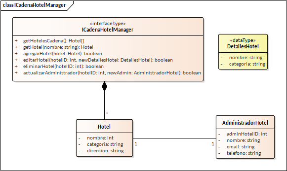
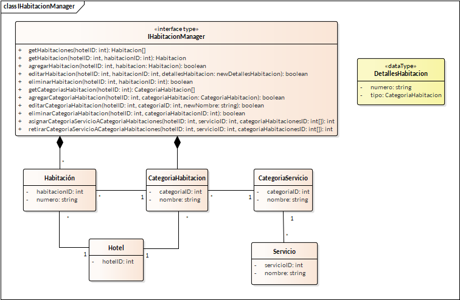
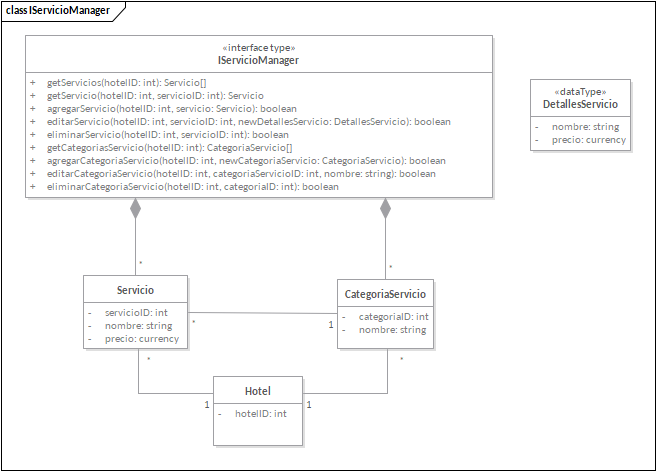
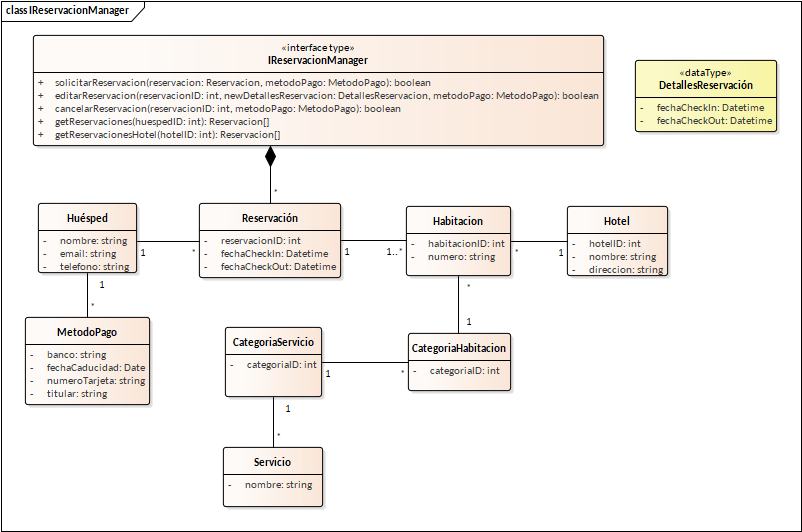
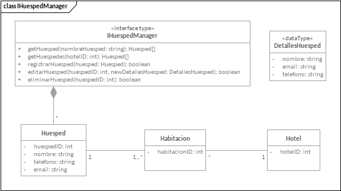
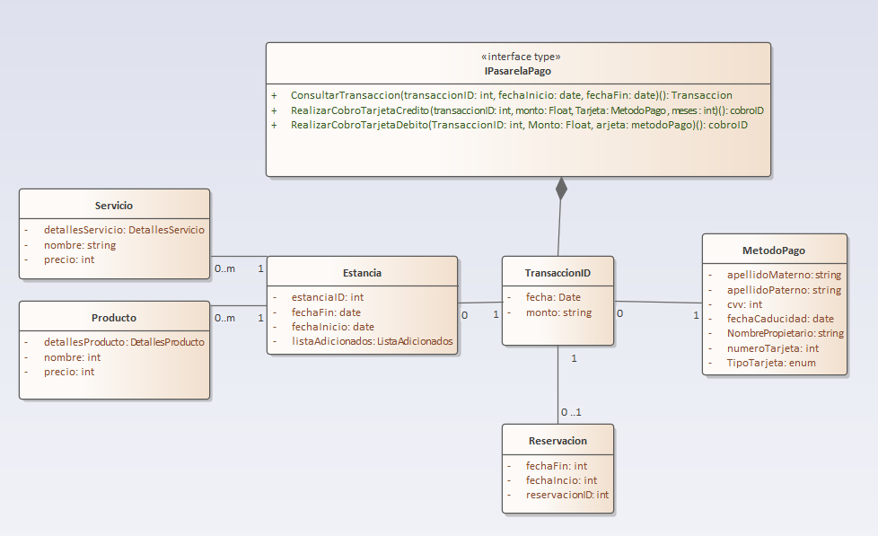

== Especificación de interfaces

=== Interfaces SistemaCadenaHotel

==== ICadenaHotelManager

*getHotelesCadena() : Hotel[]* +
``pre:`` +
Hay almenos un hotel registrado +
``pos:`` +
Devuelve todos los hoteles de la cadena

*getHotel(nombre: string) : Hotel* +
``pre:`` +
Hay almenos un hotel de la cadena cuyo nombre es similiar al in:nombre +
``pos:`` +
Devuelve todos los hoteles de la cadena cuyo nombre es similar al in:nombre

*agregarHotel(hotel: Hotel) : boolean* +
``pre:`` +
No hay un hotel registrado y activo con los mismos datos: nombre, categoria y direccion +
``pos:`` +
Registra un nuevo hotel en el sistema +
Devuelve true si el hotel fue registrado exitosamente

*editarHotel(hotelID: int, newDetallesHotel: DetallesHotel) : boolean* +
``pre:`` +
Hay al menos un hotel registrado 

``pos:`` +
Actualiza el nombre y/o la categoria del hotel al nombre y/o categoria en in:DetallesHotel para el hotel cuyo ID es igual al hotelID +
Devuelve true si los datos del hotel fueron actualizados exitosamente

*eliminarHotel(hotelID: int) : boolean* +
``pre:`` +
Hay al menos un hotel registrado y activo +
``pos:`` +
Elimina de los hoteles activos al hotel cuyo ID es igual in:hotelID +
Devuelve true si el hotel fue eliminado exitosamente

*actualizarAdministrador(hotelID: int, newAdmin: AdministradorHotel) : boolean* +
``pre:`` +
Hay al menos un hotel registrado y activo +
El administrador in:newAdmin no tiene un hotel asignado +
``pos:`` +
Asigna o sustituye el AdministradorHotel actual del Hotel cuyo ID es igual a in:hotelID +
Devuelve true si el Hotel.AdministradorHotel fue actualizado exitosamente

---

=== Interfaces SistemaHotel

==== IHotelManager

* getDatosHotel()
* getPreciosHotel()
* actualizarPreciosHotel(string rutaPrecios)

==== IHabitacionManager

*getHabitaciones(hotelID: int) : Habitacion[]* +
``pre:`` +
Hay al menos una habitacion registrada para el hotel cuyo ID es igual a in:hotelID +
``pos:`` +
Devuelve todas las habitaciones del hotel cuyo ID es igual a in:hotelID

*getHabitacion(hotelID: int, habitacionID: int) : Habitacion* +
``pre:`` +
Hay al menos una habitacion registrada para el hotel cuyo ID es igual a in:habitacionID en el hotel cuyo ID es igual a in:hotelID +
``pos:`` +
Devuelve los datos: numero, CategoriaHabitacion.nombre y los Servicio.Nombre[] de la CategoriaServicio asociadas a la Habitacion

*agregarHabitacion(hotelID: int, habitacion: Habitacion) : boolean* +
``pre:`` +
No hay una habitacion registrada con el mismo in:habitacion.Numero para el hotel cuyoID es igual a in:hotelID +
``pos:`` +
Registra una nueva habitacion en el hotel cuyo ID es igual a in:hotelID +
Devuelve true si la habitacion fue registrada exitosamente

*editarHabitacion(hotelID: int, habitacionID: int, newDetallesHabitacion: DetallesHabitacion) : boolean* +
``pre:`` +
Hay una habitacion cuyo ID es igual a in:habitacionID en el hotel cuyo ID es igual a in:hotelID +
La habitacion cuyoID es igual a in:habitacionID no esta Reservada o siendo ocupada +
``pos:`` +
Actualiza el Habitacion.numero y/o Habitacion.tipo para la habitacion cuyo ID es igual a habitacionID en el hotel cuyo ID es igual a in:hotelID +
Devuelve true si los datos de la habitacion fueron actualizados exitosamente

*eliminarHabitacion(hotelID: int, habitacionID: int) : boolean* +
``pre:`` +
Hay una habitacion cuyo ID es igual a in:habitacionID en el hotel cuyo ID es igual a in:hotelID +
La habitacion cuyoID es igual a in:habitacionID no esta Reservada o siendo ocupada +
``pos:`` +
Elimina la habitacion cuyo ID es igual a habitacionID en el hotel cuyo ID es igual a in:hotelID +
Devuelve true si la habitacion fue eliminada exitosamente

*getCategoriasHabitacion(hotelID: int) : CategoriaHabitacion[]* +
``pre:`` +
Hay al menos una CategoriaHabitacion registrada para el hotel cuyo ID es igual a in:hotelID +
``pos:`` +
Devuelve todas las categorias de habitacion para el hotel cuyo ID es igual a in:hotelID

*agregarCategoriaHabitacion(hotelID: int, categoriaHabitacion: CategoriaHabitacion) : boolean* +
``pre:`` +
No hay CategoriaHabitacion cuya CategoriaHabitacion.nombre sea igual a una de las CategoriaHabitacion[] en el hotel cuyo ID es igual a in:hotelID +
``pos:`` +
Registra una nueva CategoriaHabitacion en el hotel cuyo ID es igual a in:hotelID +
Devuelve true si la CategoriaHabitacion fue registrada exitosamente.

*editarCategoriaHabitacion(hotelID: int, categoriaID: int, newNombre: string) : boolean* +
``pre:`` +
Hay una CategoriaHabitacion cuyo ID es igual a in:categoriaID en el hotel cuyo ID es igual a in:hotelID +
No hay una Reservacion activa cuya Habitacion[] tenga una CategoriaHabitacion cuyo ID sea igual a in:categoriaID en el hotel cuyo ID es igual a in:hotelID +
``pos:`` +
Actualiza el nombre de la CategoriaHabitacion cuyo ID es igual in:categoriaID a in:newNombre +
Devuelve true si el nombre de la CategoriaHabitacion fue actualizada exitosamente.

*eliminarCategoriaHabitacion(hotelID: int, categoriaID: int) : boolean* +
``pre:`` +
Hay una CategoriaHabitacion cuyo ID es igual a in:categoriaID en el hotel cuyo ID es igual a in:hotelID +
No hay una Reservacion activa cuya Habitacion[] tenga una CategoriaHabitacion cuyo ID sea igual a in:categoriaID en el hotel cuyo ID es igual a in:hotelID +
``pos:`` +
Elimina la CategoriaHabitacion cuyo ID es igual in:categoriaID

*asignarCategoriaServicioACategoriaHabitaciones(hotelID: int, servicioID: int, categoriaHabitacionesID: int[]) : int* +
``pre:`` +
Hay un servicio cuyo ID es igual in:servicioID en el hotel cuyo ID es igual a in:hotelID +
Hay al menos una categoriaHabitacion cuyo ID es igual a un ID en in:categoriaHabitacionesID +
No hay una Reservacion activa cuya Habitacion[] tenga una CategoriaHabitacion cuyo ID se encuentre en in:categoriaHabitacionesID en el hotel cuyo ID es igual a in:hotelID +
``pos:`` +
Asigna la CategoriaSerivcio a las CategoriaHabitacion cuyos IDs coinciden con los IDs de in:categoriaHabitacionesID +
Devuelve la cantidad de CategoriaHabitacion a las que se les asigno la CategoriaServicio

*retirarCategoriaServicioACategoriaHabitaciones(hotelID: int, servicioID: int, categoriaHabitacionesID: int[]) : int* +
``pre:`` +
Hay al menos una CategoriaHabitacion asociada al servicio cuyo ID es igual in:servicioID en el hotel cuyo ID es igual a in:hotelID +
Hay al menos una categoriaHabitacion cuyo ID es igual a un ID en in:categoriaHabitacionesID +
No hay una Reservacion activa cuya Habitacion[] tenga una CategoriaHabitacion asociada a la CategoriaServicio cuyo ID sea igual a in:servicioID +
``pos:`` +
Retira la CategoriaSerivcio a las CategoriaHabitacion cuyos IDs coinciden con los IDs de in:categoriaHabitacionesID +
Devuelve la cantidad de CategoriaHabitacion a las que se les retiro la CategoriaServicio

==== IProductoManager

* getProducto()
* getProducto(string nombreProducto)
* agregarProducto(Producto producto)
* editarProducto(Producto producto)
* eliminarProducto(int productoID)

==== IServicioManager

*getServicios(hotelID: int) : Servicio[]* +
``pre:`` +
Hay al menos un hotel cuyo ID es igual a in:hotelID +
``pos:`` +
Devuelve todos los Servicios del hotel cuyo ID es igual a in:hotelID

*getServicio(hotelID: int, servicioID: int) : Servicio* +
``pre:`` +
Hay al menos un servicio cuyo ID es igual a in:servicioID en el hotel cuyo ID es igual a in:hotelID +
``pos:`` +
Devuelve el servicio cuyo ID es igual a in:servicioID del hotel cuyo ID es igual a in:hotelID

*agregarServicio(hotelID: int, servicio: Servicio) : boolean* +
``pre:`` +
No hay un servicio cuyo Servicio.nombre sea igual a uno de los servicios del hotel cuyo ID es igual a in:hotelID +
``pos:`` +
Registra un nuevo Servicio para el hotel cuyo ID es igual a in:hotelID +
Devuelve true si el Servicio fue registrado exitosamente

*editarServicio(hotelID: int, servicioID: int, newDetallesServicio: DetallesServicio) : boolean* +
``pre:`` +
Hay un servicio cuyo ID es igual a in:servicioID en el hotel cuyo ID es igual a in:hotelID +
No hay un servicio cuyo Servicio.nombre sea igual a uno de los servicios del hotel cuyo ID es igual a in:hotelID +
No hay una Reservacion activa cuya Habitacion[] tenga una CategoriaHabitacion asociada a la CategoriaServicio a la que pertenece el servicio cuyo ID es igual a in:servicioID +
``pos:`` +
Actualiza el Servicio.Nombre a newDetallesServicio.nombre y/o Servicio.Precio a newDetallesServicio.precio para el servicio del hotel cuyo ID es igual a in:servicioID +
Devuelve true si el Servicio fue actualizado exitosamente

*eliminarServicio(hotelID: int, servicioID: int) : boolean* +
``pre:`` +
Hay un servicio cuyo ID es igual a in:servicioID en el hotel cuyo ID es igual a in:hotelID +
No hay una Reservacion activa cuya Habitacion[] tenga una CategoriaHabitacion asociada a la CategoriaServicio a la que pertenece el servicio cuyo ID es igual a in:servicioID +
``pos:`` +
Elimina el servicio cuyo ID es igual a in:servicioID para el servicio del hotel cuyo ID es igual a in:servicioID +
Devuelve true si el Servicio fue eliminado exitosamente

*getCategoriasServicio(hotelID: int) : CategoriaServicio[]* +
``pre:`` +
Hay al menos un hotel cuyo ID es igual a in:hotelID +
``pos:`` +
Devuelve todas las CategoriaServicio del hotel cuyo ID es igual a in:hotelID

*agregarCategoriaServicio(hotelID: int, newCategoriaServicio: CategoriaServicio) : boolean* +
``pre:`` +
No hay una CategoriaServicio cuya CategoriaServicio.nombre sea igual a in:newCategoriaServicio en el hotel cuyo ID es igual a in:hotelID +
``pos:`` +
Registra una nueva CategoriaServicio para el hotel cuyo ID es igual a in:hotelID +
Devuelve true si la CategoriaServicio fue registrada exitosamente

*editarCategoriaServicio(hotelID: int, categoriaServicioID: int, nombre: string) : boolean* +
``pre:`` +
Hay una CategoriaServicio cuyo ID es igual a in:categoriaServicioID en el hotel cuyo ID es igual a in:hotelID +
No hay una CategoriaServicio.nombre cuyo nombre sea igual a in:nombre en el hotel cuyo ID es igual a in:hotelID +
No hay una Reservacion activa cuya Habitacion[] tenga una CategoriaHabitacion asociada a la CategoriaServicio cuyo ID sea igual a in:categoriaServicioID +
``pos:`` +
Actualiza el nombre de la CategoriaServicio a in:nombre +
Devuelve true si la CategoriaServicio fue actualizada exitosamente

*eliminarCategoriaServicio(hotelID: int, categoriaID: int) : boolean* +
``pre:`` +
Hay una CategoriaServicio cuyo ID es igual a in:categoriaID en el hotel cuyo ID es igual a in:hotelID +
No hay una Reservacion activa cuya Habitacion[] tenga una CategoriaHabitacion asociada a la CategoriaServicio cuyo ID sea igual a in:categoriaID +
``pos:`` +
Elimina la CategoriaServicio en el hotel cuyo ID es igual a in:hotelID +
Devuelve true si la CategoriaServicio fue eliminada exitosamente

==== IEmpleadoManager

* getEmpleados()
* getEmpleado(string nombreEmpleado)
* agregarEmpleado(Empleado empleado)
* editarEmpleado(Empleado empleado)
* eliminarEmpleado(int empleadoID)

---

=== Interfaces SistemaReservacion

==== IReservacionManager

*solicitarReservacion(reservacion: Reservacion, metodoPago: MetodoPago) : boolean* +
``pre:`` +
No hay otra reservacion cuya Reservacion.fechaInicio >= in:reservacion.fechaInicio && Reservacion.fechaFin <= in:reservacion.fechaFin para alguna de las habitaciones en in:reservacion.Habitacion[] +
Completar la reservacion no infringira la Politica de Overbooking configurada para la CategoriaHabitacion o las fechas check-in y check-out asociadas a la Reservacion +
La pasarela de pagos debe estar disponible +
La transaccion debe ser aprobada por la pasarela de pagos +
``pos:`` +
Se registra una nueva Reservacion +
El sistema envia el comprobante de pago al correo electronico del huesped +
El sisema envia el comprobante de Reservacion al correo electronico del huesped +
Devuelve true si la Reservacion fue completada exitosamente

*editarReservacion(reservacionID: int, newDetallesReservacion: DetallesReservacion, metodoPago: MetodoPago) : boolean* +
``pre:`` +
El huesped tiene al menos una Reservacion activa +
Hay una reservacion cuyo ID es igual a in:reservacionID +
No hay otra reservacion cuya Reservacion.fechaInicio >= in:newDetallesReservacion.fechaInicio && Reservacion.fechaFin <= in:newDetallesReservacion.fechaFin para alguna de las habitaciones asociadas a la reservacion cuyo ID es igual a in:reservacionID +
Cambiar la duracion de la estancia no infringira la Politica de Overbooking configurada para la CategoriaHabitacion o las fechas check-in y check-out asociadas a la Reservacion +
Cambiar la duracion de la estancia no infringe la Politica de cambio de reserva configurada en el sistema +
La pasarela de pagos debe estar disponible +
La transaccion debe ser aprobada por la pasarela de pagos +
``pos:`` +
Se actualiza la Reservación cuyo ID es igual a reservacionID +
El sistema envia el comprobante de pago actualizado al correo electronico huesped +
El sistema envia el comprobante de reservacion actualizado al correo electronico del huesped +
Devuelve true si la reservacion fue actualizada exitosamente

*cancelarReservacion(reservacionID: int, metodoPago: MetodoPago) : boolean* +
``pre:`` +
El huesped tiene al menos una Reservacion activa +
Hay una reservacion cuyo ID es igual a in:reservacionID +
La pasarela de pagos debe estar disponible +
La transaccion debe ser aprobada por la pasarela de pagos +
``pos:`` +
Se elimina la Reservación cuyo ID es igual a reservacionID +
El sistema devuelve al cliente el monto correspondiente de acuerdo con la Politica de cancelación configurada en el sistema, al MetodoPago utilizado para pagar la reservacion +
El sistema envia el cliente el comprobante de cancelacion +
Devuelve true si la Reservacion fue cancelada exitosamente

*getReservaciones(huespedID: int) : Reservacion[]* +
``pre:`` +
El huesped cuyo ID es igual in:huspedID tiene al menos una Reservacion activa +
``pos:`` +
Devuelve todas las Reservaciones activas del huesped, incluyendo los datos: Hotel.nombre, Hotel.direccion, Habitacion.numero, Huesped.nombre, Huesped.email, Huesped.telefono, Reservacion.fechaInicio, Reservacion.fechaFin, y los Servicio.nombre[] pertenecientes a la CategoriaServicio asociada a la CategoriaHabitacion por cada Habitacion en Reservacion.Habitacion[]

*getReservacionesHotel(hotelID:int): Reservacion[]* +
``pre:`` +
Hay al menos un hotel cuyo ID es igual a in:hotelID +
Hay al menos una Reservacion activa para el hotel cuyo ID es igual a in:hotelID +
``pos:`` +
Devuelve todas las Reservaciones activas del hotel cuyo ID es igual in:hotelID, incluyendo los datos: Habitacion.numero, Huesped.nombre, Huesped.email, Huesped.telefono, Reservacion.fechaInicio, Reservacion.fechaFin.

---

=== Interfaces SistemaEstancia

==== IEstanciaManager

* checkIn(Reservacion reservacion)
* checkOut(Estancia estancia)
* agregarServicioEstancia(Servicio servicio, Estancia estancia)
* agregarProductoEstancia(Producto producto, Estancia estancia)
* editarEstancia(Estancia estancia)

---

=== Interfaces SistemaHuesped

==== IHuespedManager

*getHuesped(nombreHuesped: string) : Huesped[]* +
``pre:`` +
Hay al menos un huesped cuyo nombre es similar a in:nombreHuesped +
``pos:`` +
Devuelve todos los huespedes con un nombre similar a in:nombreHuesped.

*getHuespedes(hotelID: int) : Huesped[]* +
``pre:`` +
Hay al menos un huesped con una Reservacion activa en el hotel cuyo ID es igual a in:hotelID +
``pos:`` +
Devuelve todos los huespedes con una Reservacion activa en el hotel cuyo ID es igual a in:hotelID.

*registrarHuesped(huesped: Huesped) : boolean* +
``pre:`` +
No hay otro huesped con un Huesped.email igual a in:huesped.email +
``pos:`` +
Registra un nuevo huesped en el sistema de la cadena. +
Devuelve true si el huesped fue registrado exitosamente

*editarHuesped(huespedID: int, newDetallesHuesped: DetallesHuesped) : boolean* +
``pre:`` +
Hay un huesped cuyo ID es igual a in:huespedID +
No hay otro huesped con un Huesped.email igual a in:huesped.email +
El huesped no puede cambiar su huesped.nombre si tiene una Reservacion activa +  
``pos:`` +
El sistema actualiza el huesped.nombre a newDetallesHuesped.nombre, el huesped.email a newDetallesHuesped.email y/o el huesped.telefono a newDetallesHuesped.telefono +
Devuelve true si el huesped fue actualizado exitosamente

*eliminarHuesped(huespedID: int) : boolean* +
``pre:`` +
Hay un huesped cuyo ID es igual a in:huespedID +
El huesped no tiene una Reservacion activa +  
``pos:`` +
El sistema elimina el huesped cuyo ID coincide con in:huespedID +
Devuelve true si el huesped fue eliminado exitosamente

=== IPasarelaPago

*ConsultarTransaccion(transaccionID: int, fechaInicio: date, fechaFin: date) : Transaccion* +
``pre:`` +
Hay una transacción cuyo ID es igual a in:transaccionID +
Las fechas in:fechaInicio e in:fechaFin corresponden al periodo válido para consultar la transacción +
``pos:`` +
Devuelve la Transaccion cuyo ID es igual a in:transaccionID, incluyendo los datos: Transaccion.fecha, Transaccion.monto y la información del MetodoPago utilizado.

*RealizarCobroTarjetaCredito(transaccionID: int, monto: float, tarjeta: MetodoPago, meses: int[]) : cobroID* +
``pre:`` +
La pasarela de pagos debe estar disponible +
Los datos de in:tarjeta deben ser válidos (NombrePropietario, numeroTarjeta, cvc, fechaCaducidad) +
La tarjeta debe permitir pagos diferidos según los valores en in:meses +
El monto in:monto debe ser mayor a 0 +
``pos:`` +
Registra un cobro con tarjeta de crédito asociado a in:transaccionID +
Devuelve el identificador del cobro (cobroID) si la transacción fue aprobada

*RealizarCobroTarjetaDebito(transaccionID: int, monto: float, tarjeta: MetodoPago) : cobroID* +
``pre:`` +
La pasarela de pagos debe estar disponible +
Los datos de in:tarjeta deben ser válidos +
El monto in:monto debe ser mayor a 0 +
``pos:`` +
Registra un cobro con tarjeta de débito asociado a in:transaccionID +
Devuelve el identificador del cobro (cobroID) si la transacción fue aprobada
