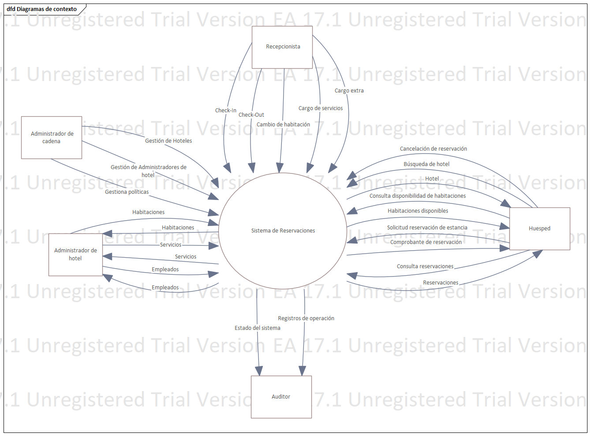
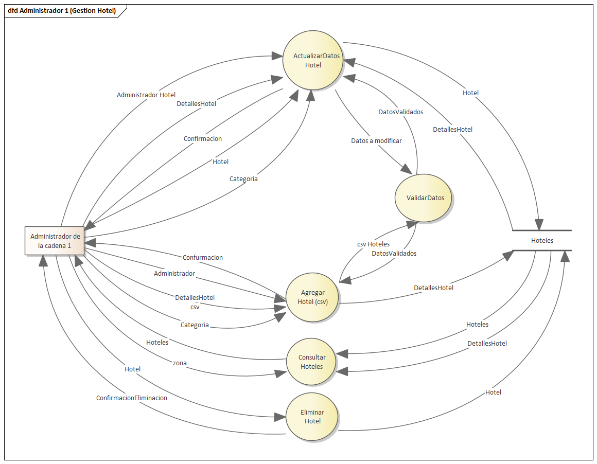
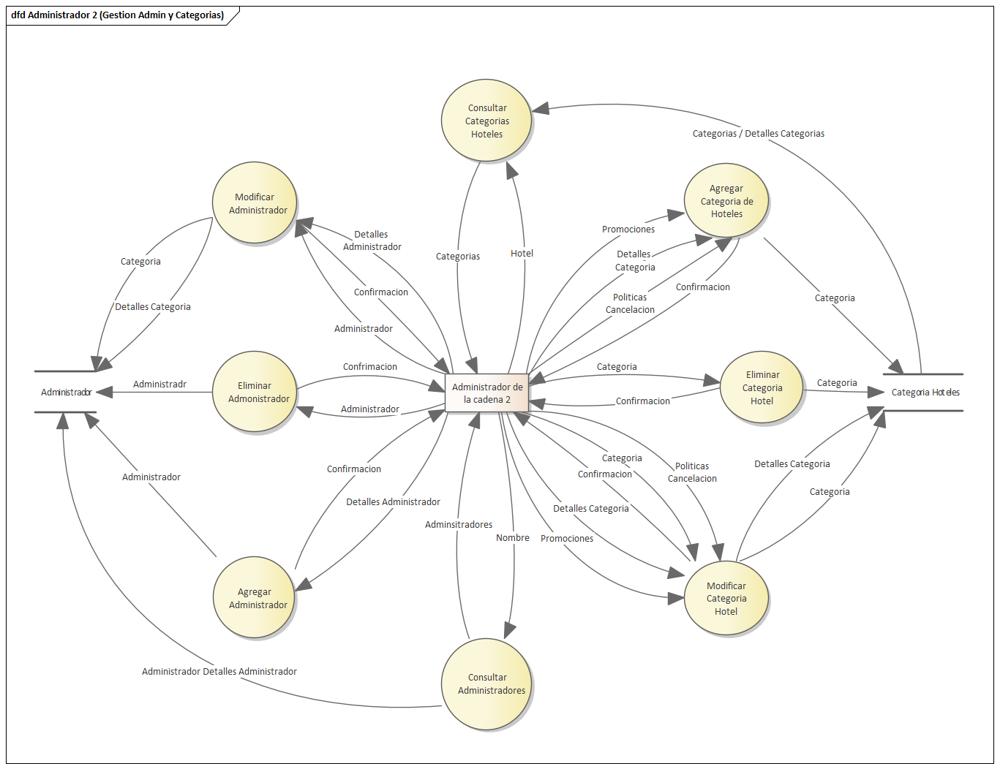
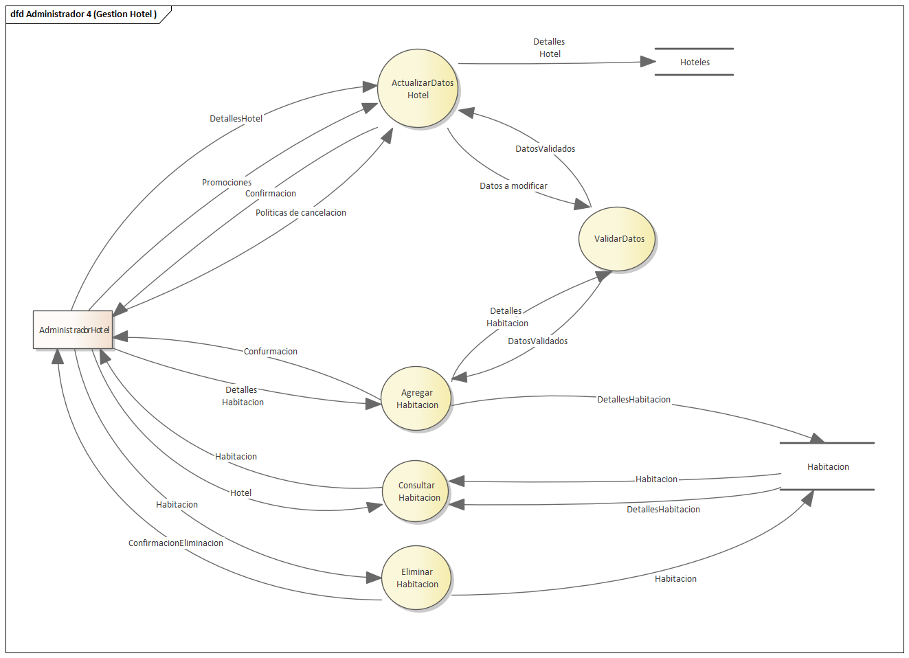
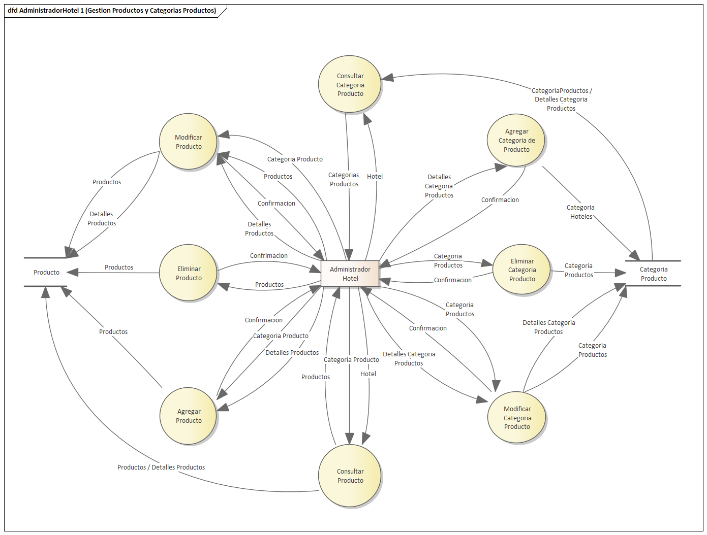
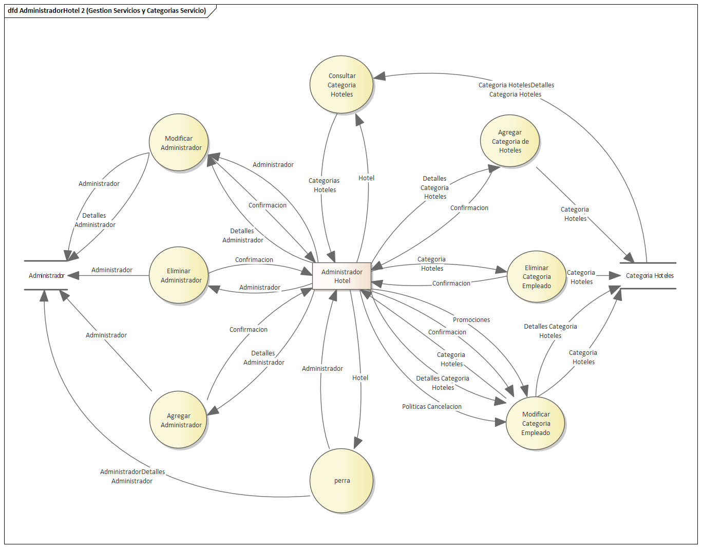
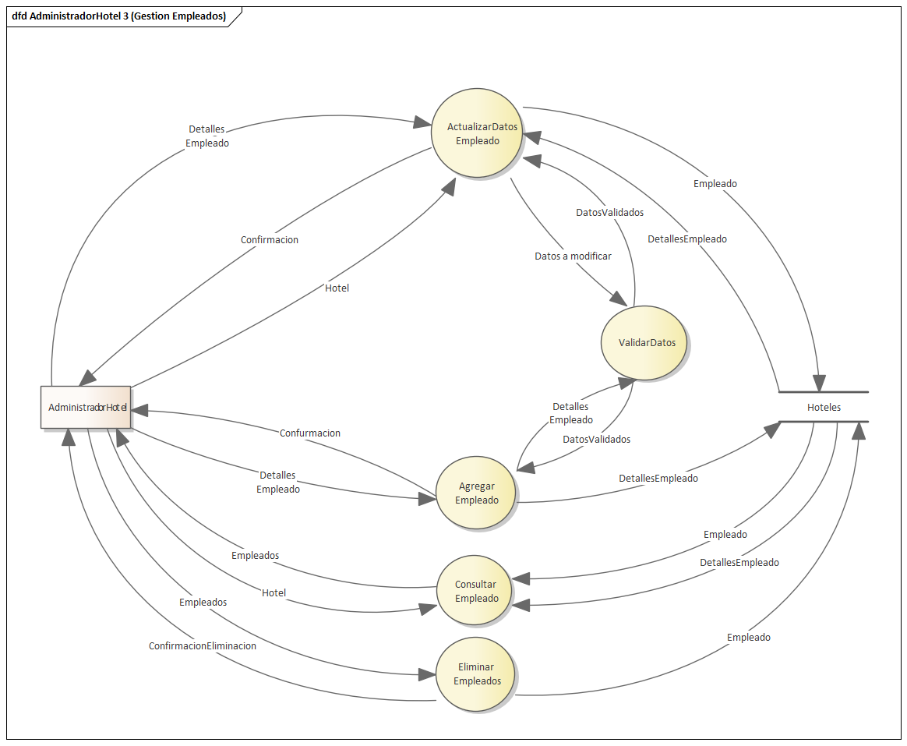
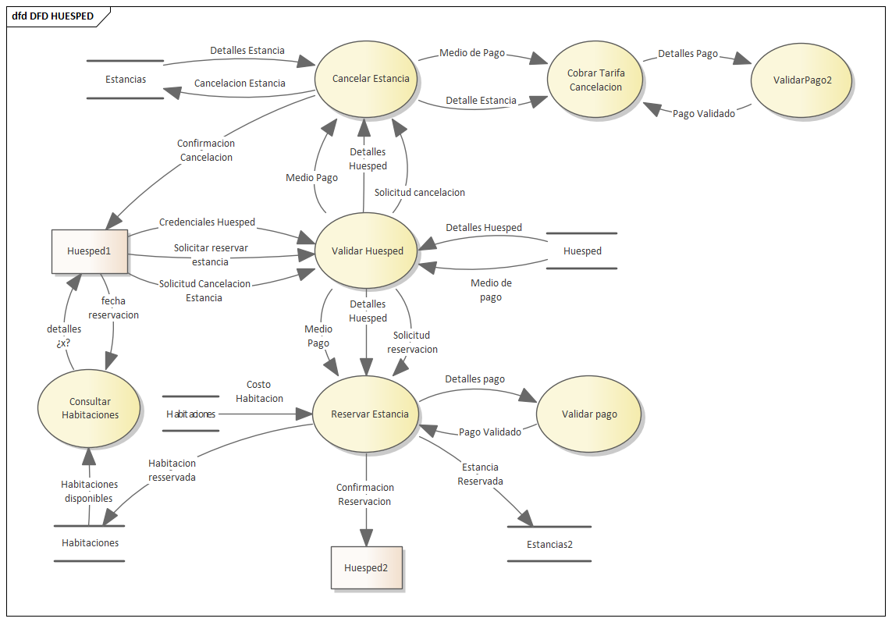
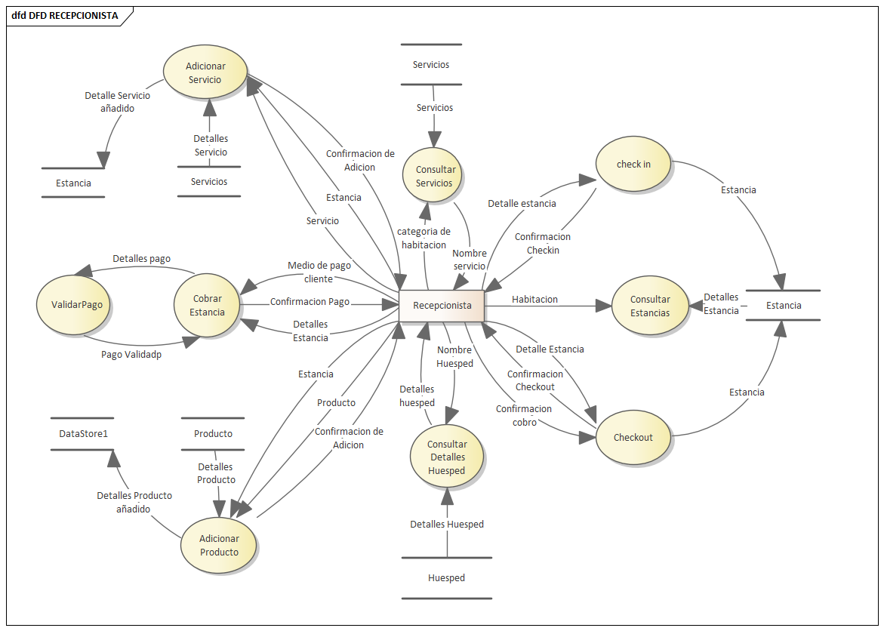
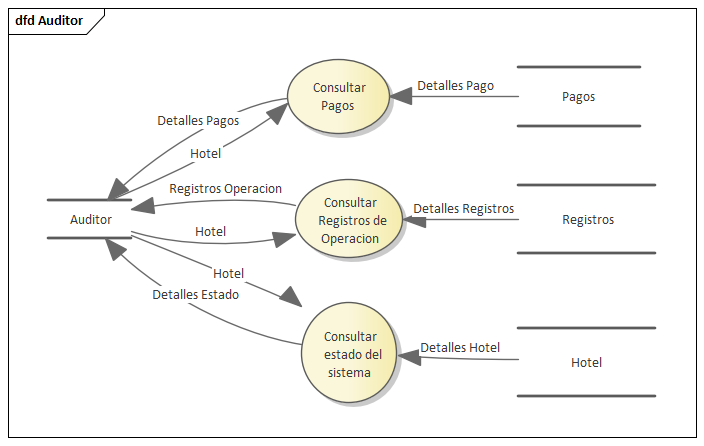

[[context-view]]
== Vista de Contexto

La vista de contexto muestra el sistema como una caja negra. Este diagrama nos servirá más adelante para hacer un DFD.

[[dfd-view]]
== Diagramas de Flujo de Datos

=== DFD del Administrador

.DFD Administrador N1 (Gestión Hotel)

.DFD Administrador N2 (Gestión Admin y Categorías)

.DFD Administrador N4 (Gestión Hotel)

=== DFD del Administrador de Hotel

.DFD AdministradorHotel N1 (Gestión Productos y Categorías de Productos)

.DFD AdministradorHotel N2 (Gestión Servicios y Categorías de Servicio)

.DFD AdministradorHotel N3 (Gestión Empleados)

=== DFD del Huésped

.Diagrama de flujo de datos del Huésped

=== DFD del Recepcionista

.Diagrama de flujo de datos del Recepcionista

=== DFD del Auditor

.Diagrama de flujo de datos del Auditor

