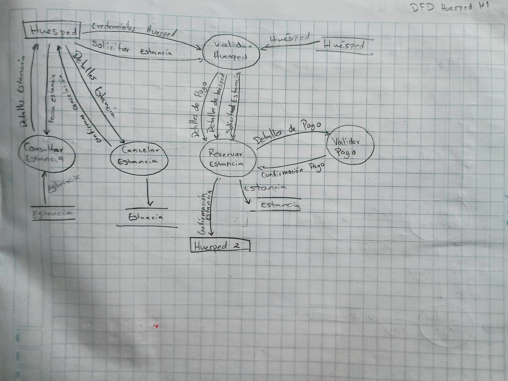

[[context-view]]
== Vista de Contexto

La vista de contexto muestra el sistema como una caja negra. Este diagrama nos servirá más adelante para hacer un DFD.

image::context.png[Context Diagram, width=600, align=center]

== Diagramas de flujo de datos

.Diagrama de flujo de datos de Huésped N1

.Diagrama de flujo de datos de Recepcionista N1

.Diagrama de flujo de datos de Recepcionista N1

