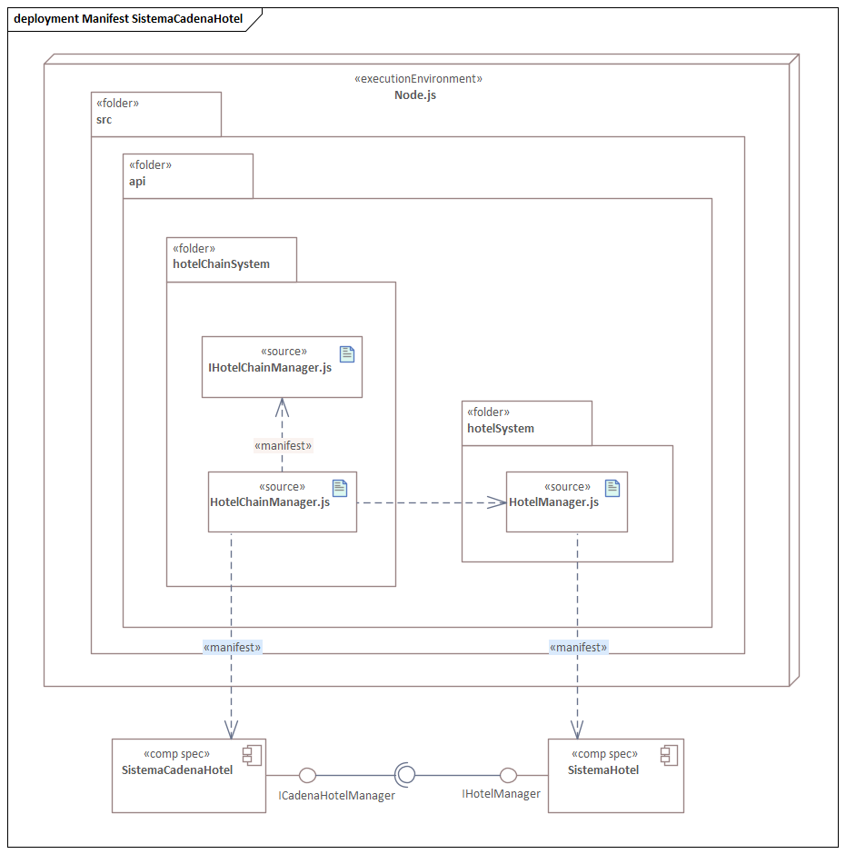
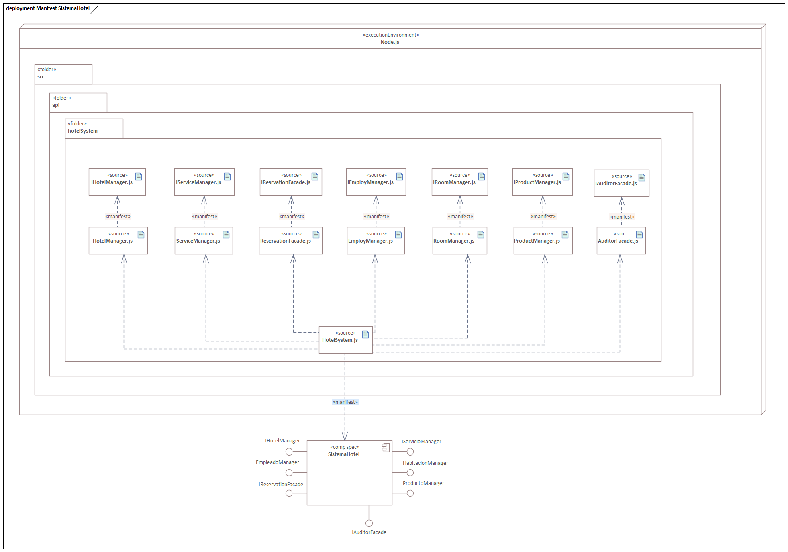
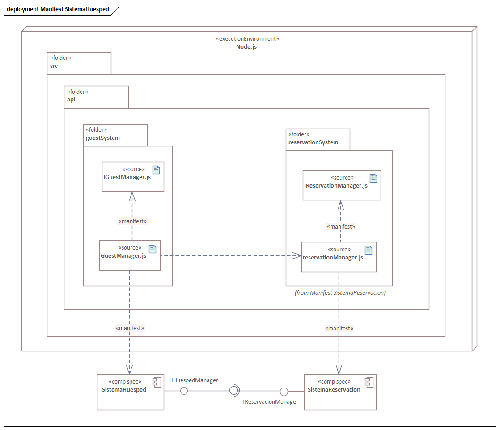
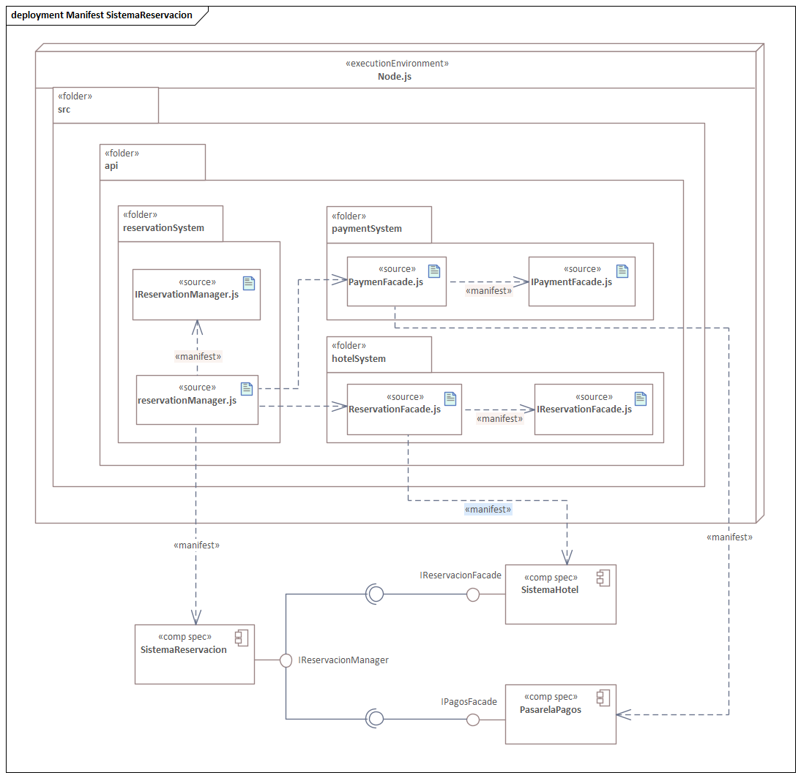
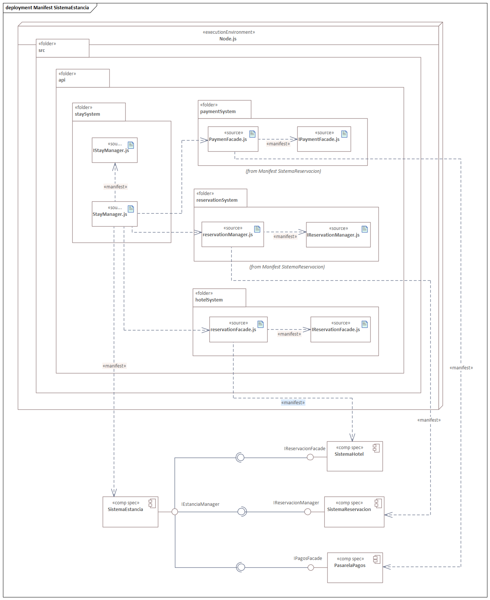
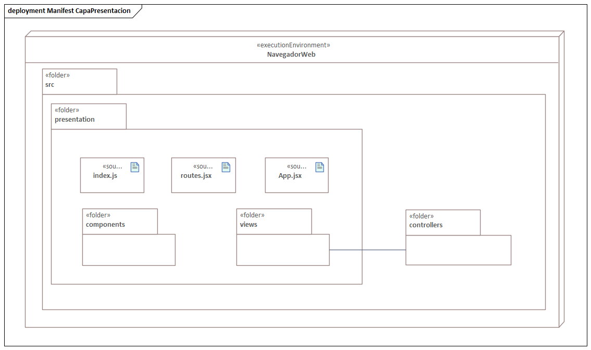
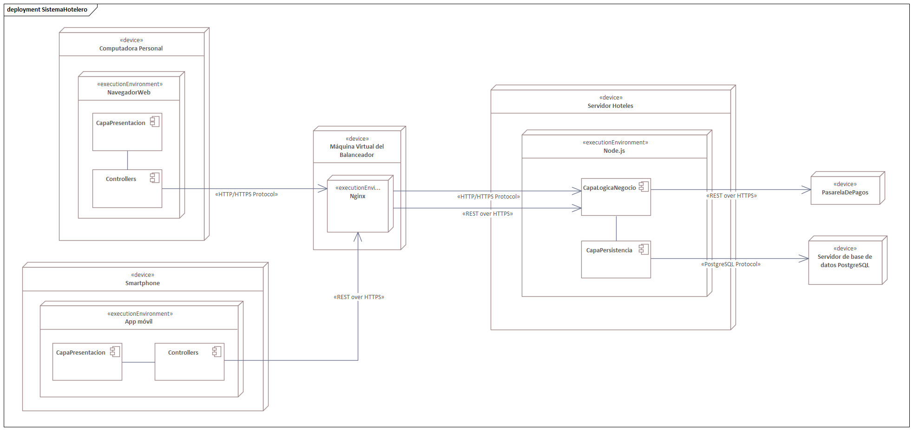

== Vista de despliegue

La parte importante de la vista de despliegue es la representación de las relaciones entre los artefactos y los nodos en los que se ejecutan.

Los diagramas de despliegue muestran las piezas de hardware en las que vive el software que se diseñó, en este caso el SUD es una aplicación web bajo el estilo arquitectónico por capas. Sin embargo, considero que es útil explicar los diagramas de manifestación primero.

A partir de aquí se representa el sistema con el supuesto uso de las siguientes tecnologías:

* *React* como motor del front-end para la página web
* *Node.js* como motor del back-end
* *Prisma* como ORM
* *PostgreSQL* para la base de datos relacional

La estructura base del sistema sería:

| src/ +
|- api/ +
|- persitance/ +
|- presentation/ +
|-- views/ +
|-- components/ +
|- controllers/

La carpeta api contendrá lo que sería la _capa de lógica de negocio_, sería la manifestación de los componentes ya antes definidos y se comunicaría con la _capa de persistencia_ (persistance/) donde estaría la lógica y los modelos del ORM (se recomienda el uso de Prisma).

Por otro lado la carpeta presentation/ contendrá la _capa de presentación_, que a su vez tendría las vistas que son lo que el usuario ve (views/) y componentes (componentes/) que en *React* son piezas de código reutilizables (como funciones en java script).

=== Diagramas de manifestación

Como primer diagrama de manifestación está el del componente _SistemaCadenaHotel_, tiene una carpeta _hotelChainSystem_ donde se guarda su interfaz y su clase de implementación. JavaScript no tiene interfaces como otros lenguajes por lo que todas las interfaces serían clases abstractas.

La clase HotelChainManager importaría HotelManager.js para poder configurar lo que ya se había mencionado en secciones anteriores.

Después tenemos el _SistemaHotel_ que como se puede apreciar contiene varias funcionalidades, es importante destacar que todas estas clases podrán ser importadas mediante la clase *HotelSystem*.

El _SistemaHuesped_ solo tendrá dentro de su carpeta _guestSystem_ su interfaz (clase abstracta) y su clase de implementación pero esta importará _ReservationManager_ para que tenga acceso a la funcionalidad de reserva.

Esto nos lleva al _SistemaReservación_ en _reservationSystem_ acá importaría la façade de la _PasarelaDePagos_ y la façade de _GuestFacade_ del _SistemaHotel_. Con esto la responsabilidad de manejar los pagos se le cede totalmente a la _PasarelaDePagos_.

Siguiendo el flujo de negocio, pasaría una _Estancia_, el _SistemaEstancia_ se vería manifestado en _StayManager_ y su clase abstracta, importando la façade de la _PasarelaDePagos_, _reservationManager_ y _GuestFacade_ para poder llevar a cabo sus propias funciones.

Por úlitmo, está la capa de presentación, la cual será lo que llega al cliente en su navegador web, considero importante mencionar que la carpeta _components/_ contiene los componentes de React, no los de nuestro sistema.

El artefacto _routes.jsx_ son las rutas de navegabilidad que tienen nuestras vistas. La capa carga desde el principio los archivos que necesita para aplicar SPA (Single-Page Application).

Como decidimos usar MVC, para respetar la comunicación entre la vista y los controladores la carpeta de _views/_ que contendrá las vistas se comunicará con sus controladores en la carpeta _controllers/_.

=== Diagrama de despliegue

Finalmente tenemos el diagrama de despliegue del sistema, donde el navegador web (cliente) con la _capa de presentación_ construída en React se comunica mediante HTTP/HTTPS con la máquina virtual con el balanceador de carga *_Nginx_* la cual se comunica meidante HTTP/HTTPS con nuestro servidor en el que se ejecuta la _capa de lógica de negocio_ y la _capa de persistencia_ bajo un ambiente de ejecución de Node.js.

En el caso de la app móvil se da como supuesto que la app móvil usa *React Native* como tecnología de construcción de front-end. Este se comunica mediante REST sobre HTTPS con el *balanceador de carga* y este se comunica con el servidor con REST sobre HTTPS.

Los datos de pago del _Huésped_ se los pasa la _capa de lógica de negocio_ mediante REST sobre HTTPS para garantizar la seguridad.

Y la _capa de persistencia_ se comunica con el servidor PostgreSQL mediante el protocolo de este.

Podemos ver claramente representada la arquitectura por capas y el uso de MVC, bien respetada.

