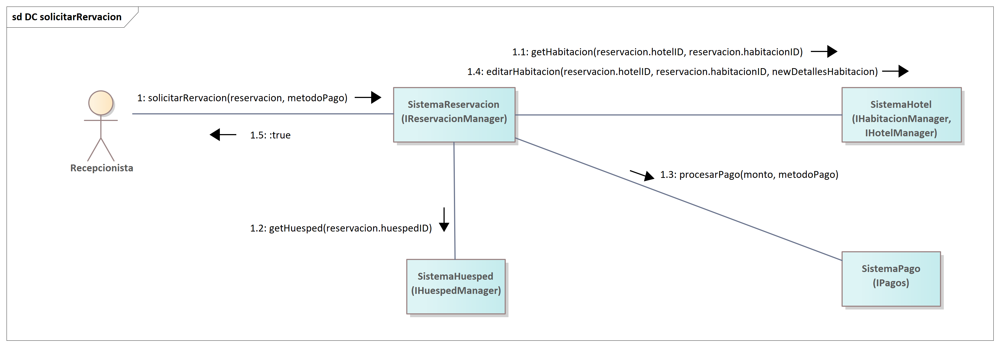
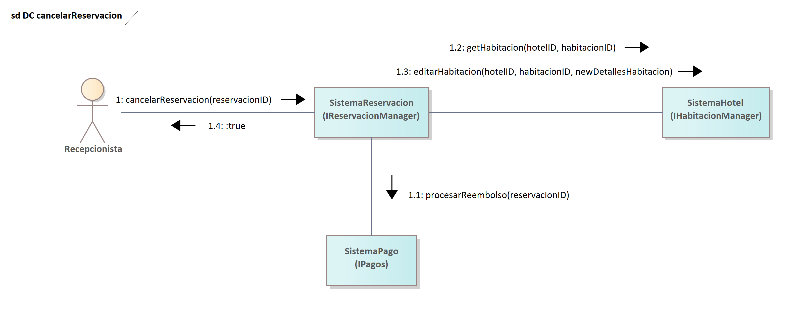
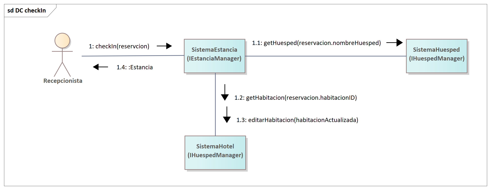
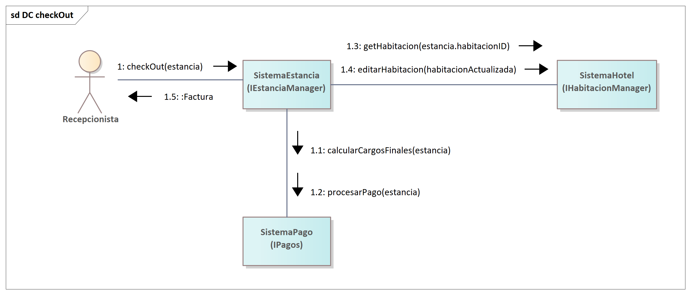
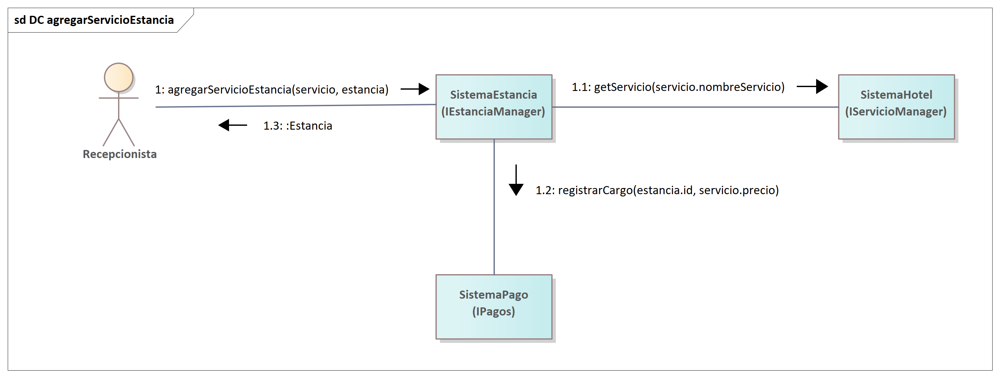
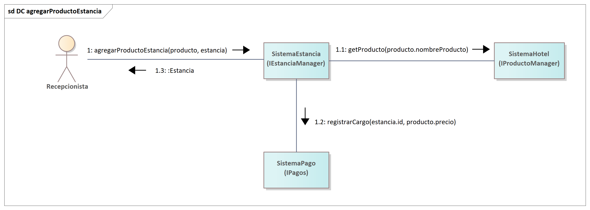

=== Interacción de componente

En esta sección se demuestra cómo los componentes de software, colaboran para realizar las funcionalidades clave del sistema. Siguiendo las directrices del proceso de diseño, se utiliza un **Diagrama de Comunicación UML** por cada operación principal de la interfaz de sistema.

El objetivo de estos diagramas es validar que las interfaces de negocio (como `IHotelMgr`, `IHuespedMgr`, `IPagos`, etc.) son suficientes y correctas para orquestar las operaciones que el sistema ofrece (como `ICheckIn` o `solicitarReservacion`). Cada diagrama muestra las instancias de los componentes y la secuencia numerada de mensajes que intercambian para completar una tarea.

==== Interacción: solicitarReservacion

El siguiente diagrama de comunicación ilustra la secuencia de mensajes para la operación `solicitarReservacion(reservacion, metodoPago)`. El componente `SistemaReservacion` actúa como coordinador principal, colaborando con `IHabitacionManager` (en `SistemaHotel`) para obtener los datos de la habitación (`getHabitacion`), `IHuespedManager` (en `SistemaHuesped`) para los datos del cliente (`getHuesped`), `IPagos` (en `SistemaPago`) para procesar el pago (`procesarPago`), y finalmente con `IHabitacionManager` de nuevo para actualizar el estado de la habitación (`editarHabitacion`).

==== Interacción: cancelarReservacion

Este diagrama muestra la colaboración de componentes para la operación `cancelarReservacion(reservacionID)`. El `SistemaReservacion` coordina con `SistemaPago` para gestionar el reembolso (`procesarReembolso`) y con `SistemaHotel` (interfaz `IHabitacionManager`) para obtener la habitación (`getHabitacion`) y luego actualizar su estado a "Disponible" (`editarHabitacion`).

==== Interacción: checkIn

A continuación, se presenta la interacción para la operación `checkIn(reservacion)`. El componente `SistemaEstancia` orquesta la colaboración, llamando a `IHuespedManager` (en `SistemaHuesped`) para verificar los datos del cliente (`getHuesped`) y a `IHabitacionManager` (en `SistemaHotel`) para actualizar el estado de la habitación de "Reservada" a "Ocupada" (`editarHabitacion`).

==== Interacción: checkOut

Este diagrama detalla la operación de `checkOut(estancia)`. Esta es una colaboración crítica donde `SistemaEstancia` se comunica con `IPagos` (en `SistemaPago`) para calcular y procesar los cargos finales (`procesarPago`). Una vez aprobado el pago, `SistemaEstancia` notifica a `IHabitacionManager` (en `SistemaHotel`) para que la habitación sea liberada y marcada como "Disponible" (`editarHabitacion`).

==== Interacción: agregarServicioEstancia

El siguiente diagrama muestra la secuencia para `agregarServicioEstancia(servicio, estancia)`. Para añadir un cargo a una estancia activa, `SistemaEstancia` primero consulta a `IServicioManager` (en `SistemaHotel`) para obtener la información y precio oficial del servicio (`getServicio`). Luego, notifica a `IPagos` (en `SistemaPago`) para que registre este nuevo cargo en el balance de la estancia (`registrarCargo`).

==== Interacción: agregarProductoEstancia

De manera similar al servicio, este diagrama ilustra la operación `agregarProductoEstancia(producto, estancia)`. El `SistemaEstancia` colaborará con `IProductoManager` (en `SistemaHotel`) para verificar el precio del producto (`getProducto`) y con `IPagos` (en `SistemaPago`) para registrar el cargo correspondiente en la cuenta de la estancia activa (`registrarCargo`).

