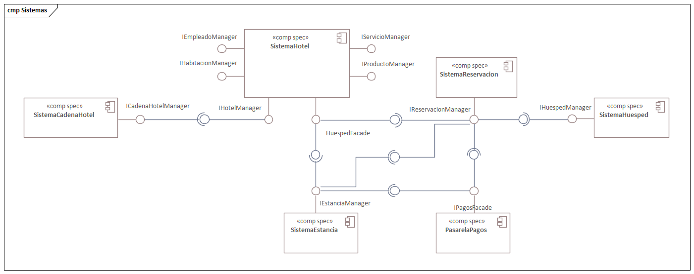

== Vista de Implementación

=== Descripción general

La vista de implementación describe la estructura física del sistema hotelero y la manera en que sus componentes se organizan e interconectan dentro del entorno de ejecución. Como se está usando el estilo arquitectónico por capas, la vista muestra cómo los módulos de software se distribuyen en diferentes capas y cómo se integran.

=== Contenido semántico

El sistema se organiza en componentes que representan los principales servicios del negocio hotelero.
Cada componente tiene una función específica y se comunica con otros a través de las interfaces:

* SistemaCadenaHotel: Se encarga de gestionar la cadena de hoteles en general.
* SistemaHotel: Gestiona la información operativa del hotel.
* SistemaHuesped: Ofrece funcionalidades al cliente para registrarse y consultar sus datos.
* SistemaEstancia: Se encarga de gestionar todas las estancias desde el check-in hasta el check-out
* SistemaReservacion: Se encarga de gestionar las reservas desde que el cliente las solicita hasta que se realiza el pago, así como modificarlas.
* PasarelaPagos: Es un sistema externo con el que nos comunicaremos mediante una interfaz para poder procesar los pagos que se deban realizar.

Estos componentes pueden acceder a una base de datos centralizada.

=== Contenido sintáctico

La implementación se estructura en una arquitectura de capas, donde cada capa agrupa componentes con responsabilidades similares:

* Capa de Presentación: interfaz web utilizada por huéspedes, recepcionistas, administradores y auditores.
* Capa de Lógica de Negocio: Contiene los servicios de negocio (reservas, estancias, auditorías).
* Capa de Datos: base de datos relacional (por ejemplo, SQL Server o PostgreSQL), se encarga de almacenar los datos de forma persistente e íntegra.
* Capa de Integración: gestiona la comunicación con sistemas externos (pasarela de pagos).

El sistema se despliega en un entorno cliente-servidor con acceso remoto a través de Internet, asegurando la disponibilidad y escalabilidad del servicio.

== Especificación de componentes

=== SistemaCadenaHotel

image:../images/Components/SistemaCadenaHotel.png[Sistema Cadena de Hotel, width=600]

*Propósito:* Administrar los hoteles de la cadena.

*Responsabilidades:* 

* Agregar hoteles.
* Consultar hoteles.
* Editar hoteles.
* Eliminar hoteles.
* Actualizar la información general de los hoteles.
* Asignar un _Administrador_ a un hotel.

*Reglas o Restricciones:* El acceso está restringido exclusivamente al _Administrador de la cadena_.

*Dependencias:* Depende del *SistemaHotel* (_IHotelManager_).

*Interfaces:* ICadenaHotel.

=== SistemaHotel

image:../images/Components/SistemaHotel.png[Sistema Hotel, width=600]

*Propósito:* Administrar un hotel en específico.

*Responsabilidades:* Gestionar (crear, consultar, actualizar y eliminar) habitaciones, servicios, productos y empleados del hotel.

*Reglas o Restricciones:* 

* El acceso está restringido exclusivamente al _Administrador del hotel_.
* Un _Hotel_ no puede eliminarse si tiene estancias o reservas activas.
* No se puede eliminar una _Habitación_ si tiene una _Estancia_ activa.

*Interfaces:* IHabitacionManager, IServicioManager, IProductoManager, IEmpleadoManager, IHuespedFacade.

=== SistemaReservacion

image:../images/Components/SistemaReservacion.png[Sistema Reservación, width=600]

*Propósito:* Gestiona las _Reservaciones_ desde el momento en el que se hace una reservación desde el sitio web evitando el overbooking.

*Responsabilidades:* Solicitar, editar (esto incluye agregar servicios o productos) y cancelar reservación.

*Reglas o Restricciones:* 

* No se puede confirmar una reservación si la _Habitación_ solicitada no está disponible los días solicitados.
* No se puede solicitar una reservación si el pago no se ha procesado o si la *PasarelaPagos* no está disponible.

*Dependencias:* La conexión con *SistemaHotel* se realiza mediante _IHuespedFacade_ y con la *PasarelaPagos* mediante _PagosFacade_.

*Interfaces:* IReservacionManager.

=== SistemaEstancia

image:../images/Components/SistemaEstancia.png[Sistema Estancia, width=600]

*Propósito:* Gestiona las _Estancias_ desde el momento en el que se realiza el check-in de una reservación hasta el check-out.

*Responsabilidades:* 

* Gestionar la información de la estancia (consultar, editar, cancelar).
* Administrar los consumos asociados a la estancia (agregar/quitar productos y servicios).
* Realizar check-in y check-out.

*Dependencias:* La conexión con el *SistemaHotel* se realiza mediante _HuespedFacade_, con la *PasarelaPagos* con _PagosFacade_ y con el *SistemaReservacion* con _IReservacionManager_.

*Reglas o Restricciones:* 

* La *PasarelaPagos* debe estar disponible para agregar productos o servicios.
* No se puede realizar un check-out si el pago no se ha procesado.

*Interfaces:* IEstanciaManager.

=== SistemaHuesped

image:../images/Components/SistemaHuesped.png[Sistema Huésped, width=600]

*Propósito:* Gestiona la información de los _Huéspedes_, maneja los datos sensibles como métodos de pago y su información personal.

*Responsabilidades:* Registrar, editar y actualizar _Huéspedes_, así como dar de baja sus cuentas.

*Dependencias:* Depende del *SistemaReservacion* (_IReservacionManager_).

*Reglas o Restricciones:* 

* La información sensible debe estar encriptada.
* No se puede eliminar un _Huésped_ si tiene estancias activas.
* Si se elimina un _Huésped_ y tiene reservaciones activas estas se cancelan.

*Interfaces:* IHuespedManager.

=== PasarelaPagos

image:../images/Components/PasarelaPagos.png[Pasarela de Pagos, width=600]

*Propósito:* Procesa los pagos de los _Huéspedes_.

*Responsabilidades:* Realiza los cobros y genera los recibos de los pagos.

*Reglas o Restricciones:* 

* La comunicación con este sistema debe tener una alta seguridad.
* Usar una Façade para comunicarse con la _Pasarela de pagos_.

*Interfaces:* IPagosFacade.

=== Vista general de los componentes del sistema

---

== Interacción de componentes

En esta sección se demuestra cómo los componentes de software, colaboran para realizar las funcionalidades clave del sistema. Siguiendo las directrices del proceso de diseño, se utiliza un *Diagrama de Comunicación UML* por cada operación principal de la interfaz de sistema.

El objetivo de estos diagramas es validar que las interfaces de negocio (como `IHotelMgr`, `IHuespedMgr`, `IPagos`, etc.) son suficientes y correctas para orquestar las operaciones que el sistema ofrece (como `ICheckIn` o `solicitarReservacion`). Cada diagrama muestra las instancias de los componentes y la secuencia numerada de mensajes que intercambian para completar una tarea.

=== Interacción: solicitarReservacion

El siguiente diagrama de comunicación ilustra la secuencia de mensajes para la operación `solicitarReservacion(reservacion, metodoPago)`. El componente `SistemaReservacion` actúa como coordinador principal, colaborando con `IHabitacionManager` (en `SistemaHotel`) para obtener los datos de la habitación (`getHabitacion`), `IHuespedManager` (en `SistemaHuesped`) para los datos del cliente (`getHuesped`), `IPagos` (en `SistemaPago`) para procesar el pago (`procesarPago`), y finalmente con `IHabitacionManager` de nuevo para actualizar el estado de la habitación (`editarHabitacion`).

image:../images/DC/DC solicitarRervacion.png[Diagrama de Comunicación - Solicitar Reservación, width=600]

=== Interacción: cancelarReservacion

Este diagrama muestra la colaboración de componentes para la operación `cancelarReservacion(reservacionID)`. El `SistemaReservacion` coordina con `SistemaPago` para gestionar el reembolso (`procesarReembolso`) y con `SistemaHotel` (interfaz `IHabitacionManager`) para obtener la habitación (`getHabitacion`) y luego actualizar su estado a "Disponible" (`editarHabitacion`).

image:../images/DC/DC cancelarReservacion.png[Diagrama de Comunicación - Cancelar Reservación, width=600]

=== Interacción: checkIn

A continuación, se presenta la interacción para la operación `checkIn(reservacion)`. El componente `SistemaEstancia` orquesta la colaboración, llamando a `IHuespedManager` (en `SistemaHuesped`) para verificar los datos del cliente (`getHuesped`) y a `IHabitacionManager` (en `SistemaHotel`) para actualizar el estado de la habitación de "Reservada" a "Ocupada" (`editarHabitacion`).

image:../images/DC/DC checkIn.png[Diagrama de Comunicación - Check-In, width=600]

=== Interacción: checkOut

Este diagrama detalla la operación de `checkOut(estancia)`. Esta es una colaboración crítica donde `SistemaEstancia` se comunica con `IPagos` (en `SistemaPago`) para calcular y procesar los cargos finales (`procesarPago`). Una vez aprobado el pago, `SistemaEstancia` notifica a `IHabitacionManager` (en `SistemaHotel`) para que la habitación sea liberada y marcada como "Disponible" (`editarHabitacion`).

image:../images/DC/DC checkOut.png[Diagrama de Comunicación - Check-Out, width=600]

=== Interacción: agregarServicioEstancia

El siguiente diagrama muestra la secuencia para `agregarServicioEstancia(servicio, estancia)`. Para añadir un cargo a una estancia activa, `SistemaEstancia` primero consulta a `IServicioManager` (en `SistemaHotel`) para obtener la información y precio oficial del servicio (`getServicio`). Luego, notifica a `IPagos` (en `SistemaPago`) para que registre este nuevo cargo en el balance de la estancia (`registrarCargo`).

image:../images/DC/DC agregarServicioEstancia.png[Diagrama de Comunicación - Agregar Servicio, width=600]

=== Interacción: agregarProductoEstancia

De manera similar al servicio, este diagrama ilustra la operación `agregarProductoEstancia(producto, estancia)`. El `SistemaEstancia` colaborará con `IProductoManager` (en `SistemaHotel`) para verificar el precio del producto (`getProducto`) y con `IPagos` (en `SistemaPago`) para registrar el cargo correspondiente en la cuenta de la estancia activa (`registrarCargo`).

image:../images/DC/DC agregarProductoEstancia.png[Diagrama de Comunicación - Agregar Producto, width=600]

---