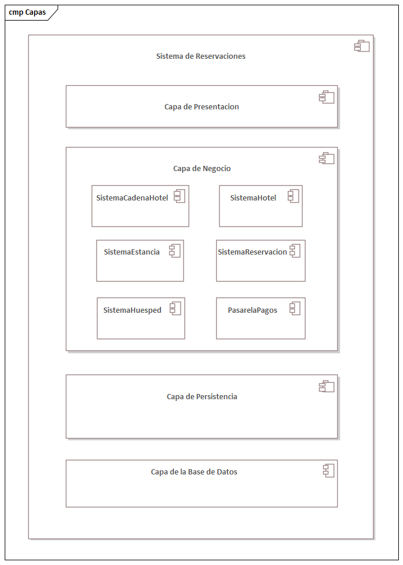
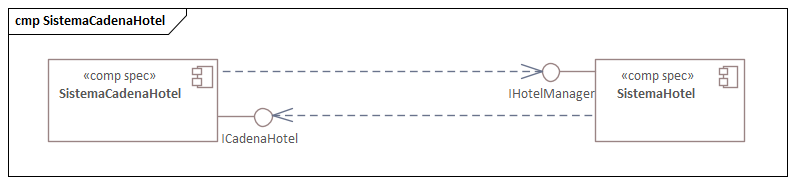
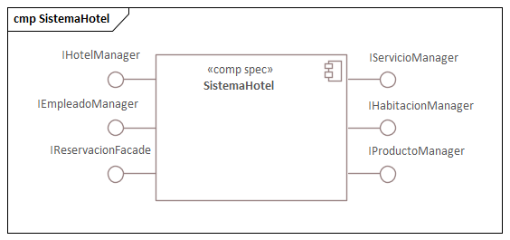
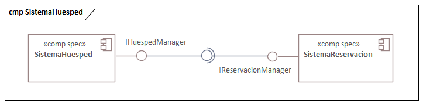
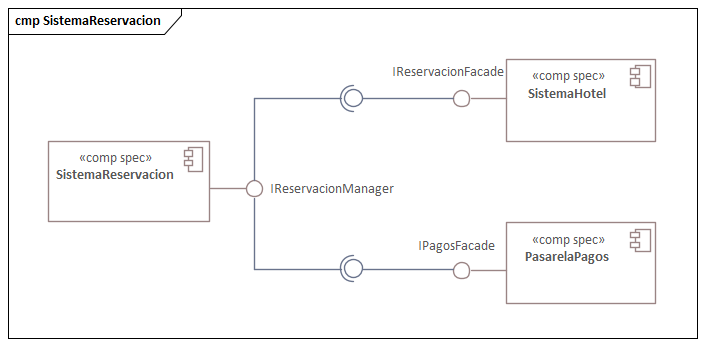
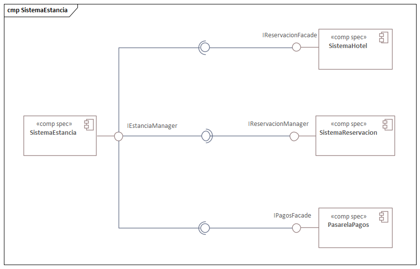
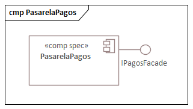
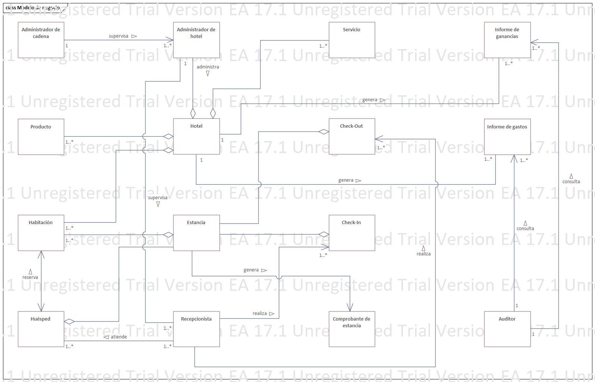
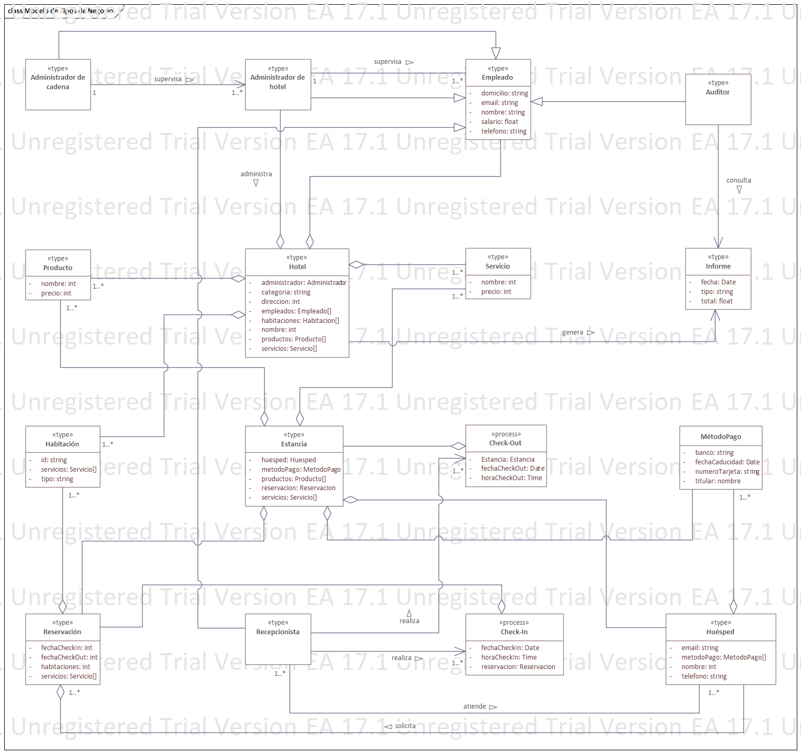

== Vista lógica

El sistema está basado en el estilo arquitectónico por lo que cada una de las capas puede modificarse sin afectar a las demás, lo cual hace que el sistema sea escalable incluyendo bases de datos y componentes. Resulta importante definir el tamaño de estas capas, esto lo podemos delimitar fácilmente mediante su objetivo, la capa debe ser independiente y contribuír un comportamiento importante a todo el sistema.

Tomando en cuenta que necesitamos un alto grado de *seguridad*, un componente que maneje los datos del _Huésped_ es necesario. Lamentablemente, una de las debilidades de este estilo es la *tolerancia a fallos* así que tendremos que usar ciertas tácticas para mejorarlo, como _redundancia_ en componentes críticos o _automatización_ de recuperación.

=== ¿Por qué usar la arquitectura por capas?

Esta arquitectura se eligió principalmente por su sencillez para implementarla y su bajo costo. Esta arquitectura se recomienda para aplicaciones o páginas web pequeñas, como la que se está diseñando. También se consideró que al tener componentes en distintas capas se pueden mejorar dos de nuestros ASRs: la *Seguridad* y la *Disponiblilidad*. En el ámbito de la *seguridad* se eligió por tres razones principales:
* Al tener el sistema dividido se le puede dar a cada capa un trato de seguridad especial
** Podemos darle prioridad a la seguridad en el componente que maneja los datos del _Huesped_

En cuanto al *Rendimiento*, si bien esta arquitectura no destaca por su excelente rendimiento, se priorizó el poder agregar ciertas funcionalidades (como lo son mejoras a la seguridad) y reducir el tiempo que el sistema no está disponible para disminuir las pérdidas económicas que esa baja podría generar. Tampoco se espera que el sistema sea lento, solo no será tan rápido como otras arquitecturas.

Finalmente, la *Usabilidad* es un punto clave ya que no solo es atractiva para los _Huespedes_, sino también para los empleados del hotel, una buena usabilidad puede ahorrar la necesidad del negocio de invertir en una larga capacitación. Este estilo arquitectónico nos beneficia en este atributo porque al tener una capa de presentación podemos mejorar y actualizar la interfaz gráfica como sea necesario por el bajo acoplamiento que se genera.

=== Estructura por capas

Se puede observar en el siguiente diagrama la estructura del estilo:

==== Componentes del sistema

En *SistemaCadenaHotel* el cual implementará la interfaz _ICadenaHotelManager_, este componente está pensado para que lo use el _Administrador de la cadena_ y que desde ahí pueda administar lo que le interesa. Este necesita poder interactuar con _IHotelManager_ de *SistemaHotel*.

El *SistemaHotel* tiene como propósito gestionar la información de un hotel, así como las habitaciones (incluyendo su estado, si está reservada, ocupada o libre), servicios y productos.

Por el lado del _Huesped_ el *SistemaHuesped* manejará toda la información sensible del _Huesped_ (datos personales y métodos de pago).

El *SistemaHuesped* puede implementar el *SistemaReservacion* el cual se comunica con todos los otros sistemas que necesite para recopilar la información necesaria para poder hacer reservaciones, evitando el overbooking, reflejando el pago eficientemente y generando el comprobante de reservación. Se tomó la decisión de usar la táctica de *Bloqueo Pesimista*, por lo que se bloqueará el registro de reservaciones a base de datos mientras se registra la reserva.

Aparte del *SistemaReservacion* está el *SistemaEstancia* el cual podrá usar el _Recepcionista_ para realizar los _Check-In_ y _Check-Out_.

Finalmente se representa el *SistemaDePago*, el cual al ser un sistema externo solo nos interesa la interfaz que nos sirve de pegamento para poder enviar de forma segura el método de pago del _Huesped_.

== Trade-Offs

Como se menciono anteriormente, el principal trade off de esta iteración fue el poder mejorar la escalabilidad (va de la mano con las futuras mejoras de seguridad) y la facilidad de despliegue de dichas mejoras a costa de disminuir el rendimiento, pero mantendiendo la usabilidad del sistema lo más alto que se pueda, ya que un sistema lento y que por lo mismo disminuya la usabilidad alejará posibles clientes del negocio y lo que se busca es lo opuesto.

== Modelo de Conceptos de Negocio (MCN)

El MCN nos sirve para ver las relaciones de los conceptos importantes de nuestro problema. En este caso nos permite ver cómo se relacionan los roles principales que tiene el sistema y sus interacciones, como _Huésped_ con _Estancia_ o _Recepcionista_. Nos sirve como un vocabulario común para el diseño de la capa de negocio y de datos.

.Modelo de Conceptos de Negocio

== Modelo de Tipos de Negocio (MTN)

Comenzamos especializando el MCN conviriténdolo en un Modelo de Tipos de Negocio (MTN) para que solo contenga la información que el sistema necesita. Los tipos de negocio pueden ser físicos o no físicos, como por ejemplo, una habitación es un tipo físico mientras que un servicio es no físico.

El MCN nos da como resultado:

.Modelo de Tipos de Negocio
