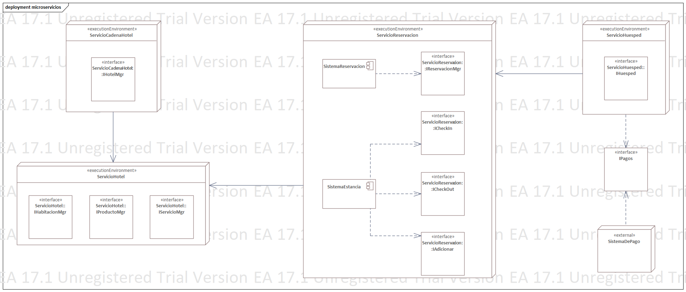
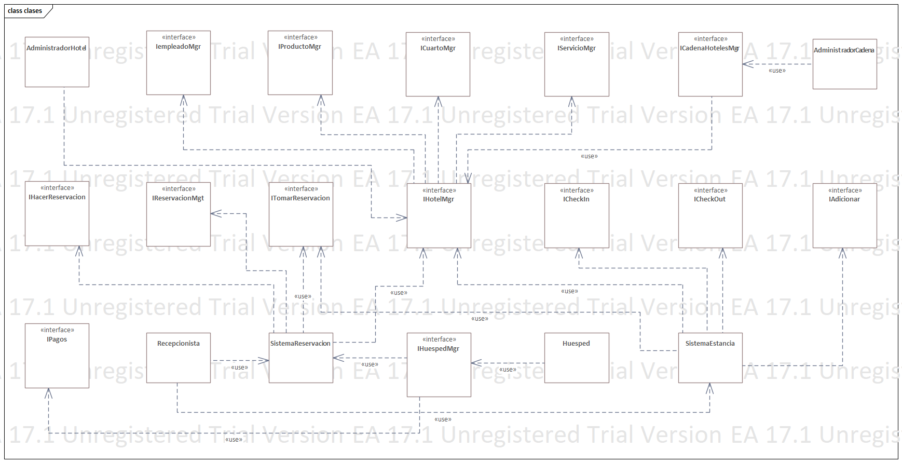

== Vista lógica

El sistema está basado en el estilo arquitectónico de Microservicios, esto nos obliga a que cada uno de los servicios pueda operar independientemente de los demás, incluyendo bases de datos y componentes dependientes. Resulta importante definir el tamaño de estos "microservicios" ya que no forzosamente deben ser sumamente pequeños, esto lo podemos delimitar fácilmente mediante su objetivo, el servicio debe ser extremadamente funcional, contribuyendo un comportamiento importante a todo el sistema.

Tomando en cuenta que necesitamos un alto grado de *seguridad*, un servicio que maneje los datos del _Huésped_ es necesario, de esta forma podríamos limitar el impacto de un ataque. Como también la *disponiblidad* es un atributo clave en el sistema, se aprovecha el punto fuerte de la arquitectura de microservicios que tiene una alta tolerancia a los fallos. Lamentablemente, una de las debilidades de este estilo es el *rendimiento*, así que tendremos que usar ciertas tácticas para mejorarlo, como _controlar la demanda y los recursos_.

=== ¿Por qué Microservicios?

El estilo arquitectónico de _Microservicios_ tiene múltiples ventajas que favorecen nuestras preocupaciones y ASRs, siendo los dos principales la *Seguridad* y la *Disponiblilidad*, como ya se mencionó, la _tolerancia a fallos_ es uno de los puntos más fuertes de este estilo y definitivamente fue una de las razones principales por las que se eligió. Pero en el ámbito de la *seguridad* se eligió por tres razones principales:
* Al tener el sistema dividido se le puede dar a cada servicio un trato de seguridad especial
** Podemos darle prioridad a la seguridad en el servicio que maneja los datos del _Huesped_
* Es fácil de desplegar
** Si existe una vulnerabilidad, el desplegar la prevención y mitigación de la vulnerabilidad será sencillo y el sistema estará "abajo" menos tiempo
* Es una solución sumamente escalable, por lo que agregar de medidas de seguridad no afectará al sistema existente
** Con las constantes actualizaciones de los atacantes el sistema debe mantenerse seguro sin afectar lo ya diseñado e implementado
** Se ven muchas oportunidades de escalar el sistema para beneficiar el negocio

En cuanto al *Rendimiento*, si bien esta arquitectura no destaca por su excelente rendimiento, se priorizó el poder agregar ciertas funcionalidades (como lo son mejoras a la seguridad) y reducir el tiempo que el sistema no está disponible para disminuir las pérdidas económicas que esa baja podría generar. Tampoco se espera que el sistema sea lento, solo no será tan rápido como otras arquitecturas.

Como ya se comentó es una solución altamente escalable, lo cual nos interesa por la cantidad de hoteles que manejará el sistema (más de 5000), por lo que la necesidad de funciones específicas o no solicitadas en primera instancia surgirá y el sistema debe poder implementarlas sin afectar lo existente.

Finalmente, la *Usabilidad* es un punto clave ya que no solo es atractiva para los _Huespedes_, sino también para los empleados del hotel, una buena usabilidad puede ahorrar la necesidad del negocio de invertir en una larga capacitación. El estilo arquitectónico no afecta mucho en este atributo, sin embargo, por el bajo acoplamiento que se genera es posible cambiar la interfaz gráfica libremente sin tener que cambiar la lógica detrás.

=== Representación de los microservicios

Podemos observar en el siguiente diagrama la estructura del estilo:

Como podemos ver cada servicio tiene ciertas interfaces que deben implementar, cada uno tiene un rol el cual va acorde al rol del usuario que lo utiliza.

Tenemos el *ServicioCadenaHotel* el cual implementará la interfaz _ICadenaHotelManager_, este servicio está pensado para que lo use el _Administrador de la cadena_ y que desde ahí pueda administar lo que le interesa.

Después el *ServicioCadenaHotel* se comunica con el *ServicioHotel* al cual solo puede acceder el _Administrador del hotel_. Tiene como propósito gestionar la información del hotel que dirige. Además el _Administrador del hotel_ podrá administrar al personal del hotel.

Por el lado del _Huesped_ el *ServicioHuesped* manejará toda la información sensible del _Huesped_ (datos personales y métodos de pago). 

El *ServicioHuesped* puede implementa el *ServicioReservacion* el cual se comunica con todos los otros servicios que necesite para recopilar la información necesaria para poder hacer reservaciones, evitando el overbooking, reflejando el pago eficientemente y generando el comprobante de reservación.

Aparte del *ServicioReservacion* está el *ServicioEstancia* el cual podrá usar el _Recepcionista_ para realizar los _Check-In_ y _Check-Out_.

Finalmente se representa el *SistemaDePago*, el cual al ser un sistema externo solo nos interesa la interfaz que nos sirve de pegamento para poder enviar de forma segura el método de pago del _Huesped_.

==== Representación de los microservicios en clases

_Nota: Este no es un diagrama de implementación_

En esta otra representación del estilo que estamos usando podemos ver mejor qué roles implementarán cada Servicio y cómo están comunicados los servicios.

== Trade-Offs

Como se menciono anteriormente, el principal trade off de esta iteración fue el poder mejorar la escalabilidad (va de la mano con las futuras mejoras de seguridad) y la facilidad de despliegue de dichas mejoras a costa de disminuir el rendimiento, pero mantendiendo la usabilidad del sistema lo más alto que se pueda, ya que un sistema lento y que por lo mismo disminuya la usabilidad alejará posibles clientes del negocio y lo que se busca es lo opuesto.

== Modelo de Conceptos de Negocio (MCN)

El MCN nos sirve para ver las relaciones de los conceptos importantes de nuestro problema. En este caso nos permite ver cómo se relacionan los roles principales que tiene el sistema y sus interacciones, como _Huésped_ con _Estancia_ o _Recepcionista_. Nos sirve como un vocabulario común para el diseño de la capa de negocio y de datos.

.Modelo de Conceptos de Negocio
image::../images/modeloConceptosNegocio.png[MCN, width=600, align=center]

== Modelo de Tipos de Negocio (MTN)

Comenzamos especializando el MCN conviriténdolo en un Modelo de Tipos de Negocio (MTN) para que solo contenga la información que el sistema necesita. Los tipos de negocio pueden ser físicos o no físicos, como por ejemplo, una habitación es un tipo físico mientras que un servicio es no físico.

El MCN nos da como resultado:

.Modelo de Tipos de Negocio
image::../images/modeloTiposNegocio.png[MTN, width=600, align=center]