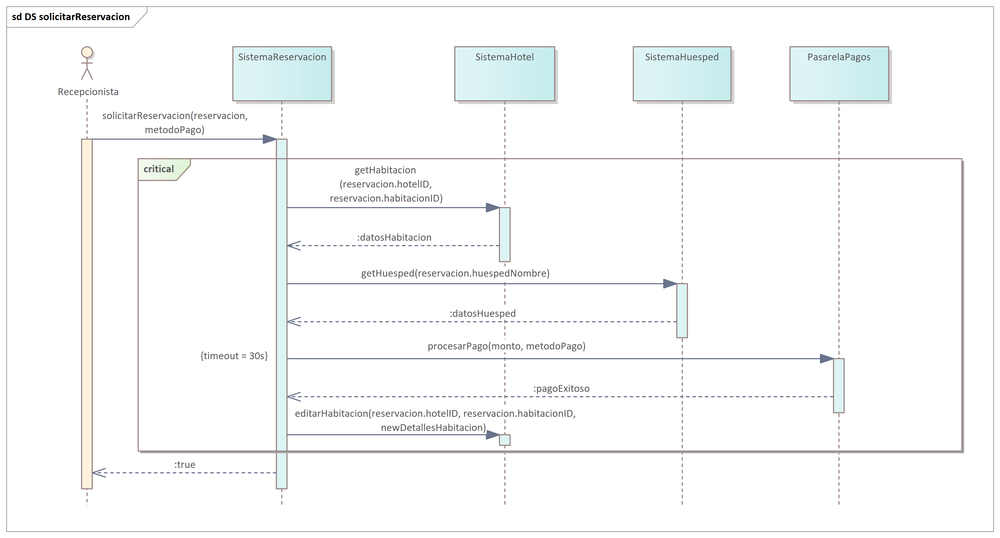

=== 5.3 Vista de Proceso

Esta vista detalla el comportamiento dinámico del sistema, enfocándose en cómo los componentes de la Capa de Negocio interactúan en tiempo de ejecución para satisfacer los atributos de calidad de **Rendimiento** y **Disponibilidad**. Dado que se ha seleccionado una arquitectura basada en capas, el modelo de concurrencia principal adoptado es **síncrono y basado en hilos (Thread-per-Request)**.

En este modelo, cada solicitud entrante del usuario es procesada secuencialmente por las capas de negocio y persistencia. Para mitigar bloqueos, se utiliza un **Pool de Conexiones** eficiente hacia la base de datos. A continuación, se describen los dos flujos más críticos del sistema: `solicitarReservacion` y `checkOut`, seleccionados por su impacto en la integridad financiera y operativa.

==== Flujo Crítico 1: Solicitar Reservación

Este proceso representa el corazón transaccional del sistema. Su objetivo es coordinar de manera atómica la disponibilidad del inventario con la confirmación de un pago externo, garantizando una política de **Consistencia Fuerte** (ACID).

* **Secuencia y Sincronización:**
El diagrama muestra una interacción estrictamente **sincrónica**. El `SistemaReservacion` actúa como orquestador, bloqueando el hilo de ejecución mientras realiza las validaciones secuenciales: primero obtiene la disponibilidad (`getHabitacion`) y los datos del cliente (`getHuesped`), y posteriormente contacta a la pasarela de pagos.

* **Integridad y Transacción ACID:**
Como se denota en el fragmento *critical*, toda la operación ocurre dentro de una transacción de base de datos. Se aplica un **Bloqueo Pesimista** sobre el registro de la habitación desde el momento de su lectura. La transacción solo se confirma (commit) después de que la `PasarelaPagos` responde exitosamente y el sistema ejecuta `editarHabitacion` para cambiar el estado a "Reservada". Si el pago falla, se ejecuta un *rollback*, liberando la habitación inmediatamente.

* **Disponibilidad (Manejo de Latencia):**
Para proteger al sistema de fallos en el servicio externo de pagos, se establece un **Timeout de 30 segundos** en la llamada `procesarPago`. Si la `PasarelaPagos` no responde en este tiempo, el sistema aborta la operación para liberar los recursos del servidor y mantener la disponibilidad para otros usuarios.

